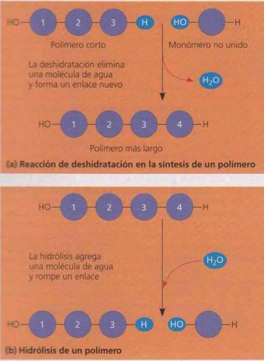
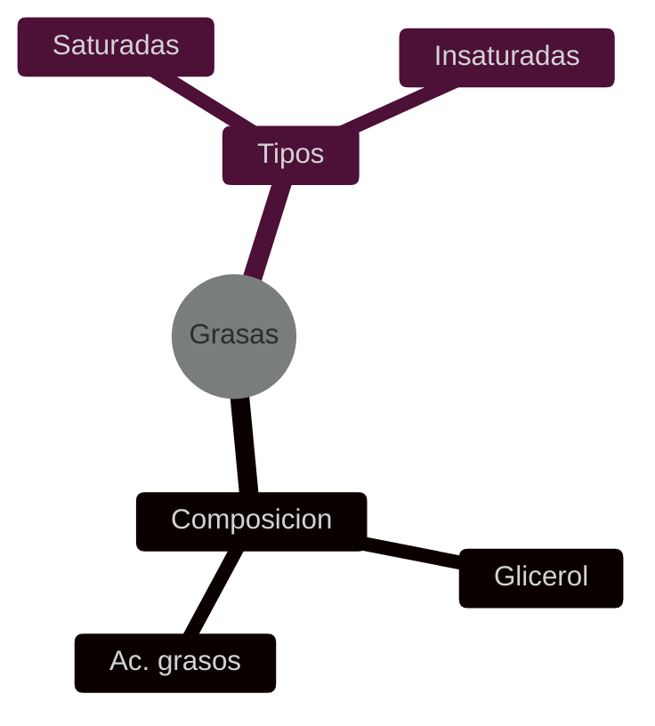
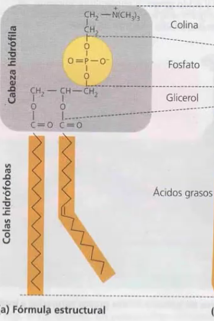
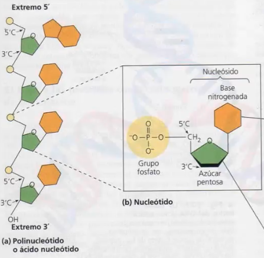
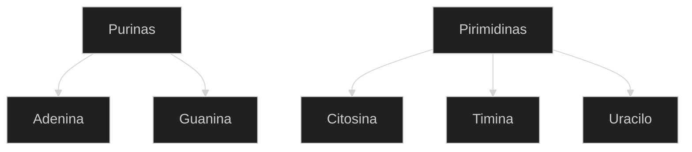

# Origen de la vida
## Experimento Miller
se utilizaron descargas eléctricas, que simulaban rayos, para desencadenar reacciones en una “atmósfera primitiva” formada por H2O, H2, NH3, CH4 (metano), algunos de los gases liberados por los volcanes. En el aparato de Miller se sintetizaron algunos de los compuestos claves para la vida, es decir que los compuestos orgánicos pueden haberse sintetizado de forma abiótica en la Tierra primitiva
**teoria de la abiogenesis:** se formaron aminoacidos, azucares y lipidos	

# Biomoleculas
### Reacciones
- Deshidratacion: dos polimeros con extremos -OH -H se unen y liberan H20. Proceso anabólico (requiere aporte de energía)
- Hidrolosis: ruptura de polimero consumiendo H20. Catabólico

## Hidratos de carbono
Estructura quimica: esqueleto de carbono con hidroxilos y carboxilo (grupo acido) terminal
 - Monosacáridos:  son azúcares simples que suelen tener como fórmula algún múltiplo de la fórmula CH2O. 
	 - Funcion: obtencion de energia por ruptura de enlaces. Ej.: Glucosa
-  Disacáridos: son dos monosacáridos unidos por una unión glucosídica. Ej: Lactosa 
- Polisacáridos: son macromoléculas, polímeros de cientos a miles de monosacáridos unidos por uniones glucosídicas. 
	- Función: almacenamiento -> almidón, glucógeno,  estructural -> celulosa, quitina.

## Lípidos

No se componen de polímeros, tienen poca o ninguna afinidad al agua.
### Grasas
moleculas totalmente apolares (hidrofobas)
- grasas saturadas: enlaces simples, lineales, rigidez estructural en las membranas. aislamiento termico, reservas energeticas.
- insaturadas: con enlaces 2bles -> moleculas curvas, fluidez en las membranas

### Fosfolípidos
acidos grasos + cabeza polar (glicerol + fosfato + colina) -> formacion de las ==bicapas lipidicas== de las membranas celulares
cabeza polar hidrofilica, acidos grasos hidrofobicos

### Esteroides
esqueletos de carbono con 4 anillos fusionados.
- Ej: colesterol (estructura en las membranas celulaeres), hormonas.
## Proteínas
Una proteína está formada por aminoácidos unidos por enlaces peptídicos (generado por deshidratacion)
Pueden ser polares y apolares

| Tipo        | Funcion                | Ejemplo                   |
| ----------- | ---------------------- | ------------------------- |
| Enzimatica  | Aceleracion reacciones | digestivas                |
| Estructural | sosten                 | queratina (cuernos, uñas) |
| Transporte  |                        | hemoglobina               |
| Hormonal    |                        |                           |
aminoacidos:
grupo carboxilo, grupo amino y R (cadena lateral)
polares, no polares y cargados electricamente (acidos y basicos)
esto influira en la estructura, en solucion acuosa  la parte externa de la prot será polar o cargada

#### Estructuras:
- 1ria: secuencia de aa
- 2daria: pliegues int puente hidrogeno 
- 3ria: repliegue tridimensional (intx hidrofobicas, ionicas, puentes 2S, etc)
- 4naria: interacciones entre sub-unidades peptidicas 3rias.

## Ácidos nucleicos (ADN y ARN)
Polimeros formados por nucleótidos. Un nucleótido está formado por tres partes:  una base nitrogenada, una pentosa y un grupo fosfato.

### Bases nitrogenadas
Hay 5 nucleótidos en 2 grupos:

### Tabla comparativa
|             | ADN                              | ARN               |
| ----------- | -------------------------------- | ----------------- |
| Nucleotidos | C≡G T=A                          | C≡G U=A           |
| Pentosa     | desoxiribosa (H en C2)           | ribosa (OH en C2) |
| Estructura  | cadena doble helice antiparalela | cadena simple     |
|             |                                  |                   |

