# Comunidad
Una comunidad es un **conjunto de poblaciones** de especies diferentes que viven juntas, lo suficientemente cerca como para establecer interacciones potenciales 
El equilibrio de especies depende del ingreso de nuevas especies y la extención (desaparacion sea por muerte o emigracion)

## Tipos de interacción:
- Competencia: intra o inter
- Predación
- Simbiosis: 

La **estabilidad** en una comunidad está determinada por la inmigración y la extinción (desaparición de una población, no la desaparición de una especie).
Una comunidad se puede caracterizar por tamaño y por distancia. En una comunidad pequeña la inmigración y extinción afecta mucho más al número de especies.
Una comunidad de agranda por la llegada (por inmigración) que no estaba antes
Una comunidad cerca del punto de origen de una población va a tener más individuos de esa población.

# Ecosistema
comunidad con factores abioticos. ej: lago, bosque, selva
## Energia
Captada en autotrofos en la materia se va disipando como calor en la cadena trofica

La energía entra en el ecosistema, fluye y sale del mismo. Los nutrientes químicos, en cambio, se reciclan dentro del ecosistema. En este esquema generalizado, la energía (flechas anaranjadas) entra como radiación solar, se transforma en energía química que se transfiere a través de la red alimentaria, y sale del ecosistema en forma de calor hacia el espacio. La mayoría de las transferencias de nutrientes (flechas azules) a través de los niveles tróficos produce detritos; los nutrientes luego se reciclan y vuelven a los productores primarios. 

la cadena trofica tiene un limite de eslabones, xq la enrergia se va perdiendo en cada paso. la materia circula y se recicla

## Ciclos biogeoquimicos

### Ciclo agua
- estado liquido mas importante
- reservorios en oceanos
### Ciclo carbono
- fijado por orga fotosinteticos -> consumidores primarios

\*RC: respiracion celular
calentamiento global: la tasa de liberacion de CO2 es superior a la capacidad de fijar el CO2, sumado a otros gases. O
### ciclo N
importante: proteinas, ac nucleicos 
plantas: asimilacion incorganica
	consumidores 1 y 2: organico
el mas modificable por el ser humano, son pocos los organismos que lo pueden fijar.
principal entrada: bact fijadoras
desntrificantes: usan NO3- en condiciones anaerobicas como aceptor final de e- en vez de O2

```mermaid
graph LR;
N2-atm --B.Fijadoras--> NH4+
N-org --Amonificacion-->NH4+ --Nitrificación--> NO3-
NO3- --> Produc_Consumidores --> N-org
NO3- --B.desnitr--> N2-atm
```

### ciclo P
aporte: erosion rocas. ppal reservorio en suelo y oceanos 
reciclaje por detritivoros

### Impacto actividad humana
- Ruptura del ciclo: Liberacion N en la perturbacion del suelo, se elimina del sistema con la cosecha de cultivos.
- Lluvias acidas: combustiones y exceso de fertilizantes de N y P.
- Bioconcentracion: magnificacion de toxicos como hidrocarburos, que se van concentrando en la cadena trofica. (plancton -> peces -> gaviotas)
- Efecto global: cambio climatico 🠉CO2 reflexion ondas IR, disminucion de la capa de ozono (uso de O3 + CFC -> Cl2O2)

factores que determinan que una sp este presente: comportamental, barreras fisicas, competencia, factores ambientales.

nicho: de una poblacion -> de que manera explota un recurso, las interacciones que se dan alrededor
cuando se solapan los nichos de dos especies hay competencia.

nicho fundamental: el que puede explotar. ej ave que come granos, nicho capacidad de comer ese grano(pico, sistema dig).
exclusion competitiva: el solapamiento del nicho es absoluto, una especie termina desplazando a otra. 

## amenazas
destruccion del habitat: desestabiliza la red trofica (la cadena es un estudio aislado de la red).

## Comportamiento
taxia: ej plantas fototaxis
cinacis: ej bichos bolita buscando humedad

#### Migracion
-> Se genera un estimulo (luz) -> genera un comportamiento de desplazamiento entre 2 puntos buscando recursos. Ej aves, tortugas (detectan campo magetico)

#### comunicacion
- quimica: fermonas (hormonas externas volatiles)
- auditiva: aves, cigarras - reproducción
- Comunicacion elect: ej peces(detectan la despolarizacion en celulas de otros animales) 

