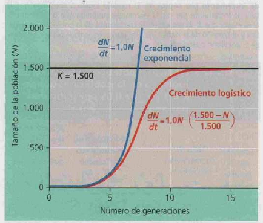
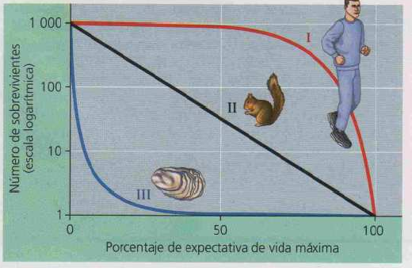

# Definicion
conj organismos = sp interfertiles, =momento, = area geografica

## Densidad 
D = cant individuos / sup o vol -> prop dinamica : nac + inm - muertes - emigracion

## Modelo crecimiento logístico
tasa de crecimiento per capita = tasa natalidad - tasa mortalidad
 $r = b - d$
 
reformulada como cambio tamaño poblacional en un periodo de tiempo
$dN/dT = r * N$

se incluye K = **capaciad de carga** en condiciones reales -> disponibilidad de recursos limitados
 $dN / dT = r * N *((K-N) / K)$
 

52.12 La velocidad de crecimiento de la población disminuye a medida que el tamaño de la población (N) se aproxima a la capacidad de carga (K) del ambiente. La línea roja muestra el crecimiento logístico de una población donde r_max= 1 y K= 1500 individuos. En comparación  la línea azul ilustra una población que continúa con su crecimiento exponencial con la misma r_max
### Fluctuacion de k
el valor de equlibrio flutua alrededor de un rango, incluso puede llegar a perder el equilibrio de acuerdo a las interacciones con otras especies y el uso de los recursos disponibles
### Factores que modifican r y la llevan a 1
- competencia por recursos
- territorialidad 
- salud
- depredacion facilitada

## Estrategias reproductivas
seleccion de los rasgos de historia de vida según la disponibilidad de recursos ambientales
### seleccion r
- muchas crias / semillas, tamaño pequeño
- maduracion rapida
- baja cuidado parental
- pocos eventos reproduct (viven menos)
Ej: insectos, roedores, plantas anuales
### seleccion k
- pocas crias/semillas, gran tamaño
- maduracion lenta
- alto cuidado parental
- varios events reproductivos
Ej: mamiferos, aves grandes, plantas perennes

## Curvas supervivencia

Las curvas tipo III tienen gran cantidad de crias y la mayoria muere, al contrario la curva I
extincion: desaparicion de la especie en una zona, puede ser emigracion total
equilibrio: inmigracion / extincion

### Pirámides poblacionales
densidad: aumenta la población aumenta la expectativa de vida al estar juntos (manada). desventajas: sanitarias, propagación rápida de enfermedades.
Paises subdesarrollados: base mayor, muchos nacimientos, alta emigracion y mortandad.

### distribución espaciales:
- agrupados: mayor interacciones, recursos agrupados. **interacción positiva** ej manada lobos
- regular: bosque de pinos, aves comiendo, compiten y se alejan de forma equidistante, interacción exclusión.
- azar: no se encuentra un patrón definido, distribución viento semillas. no hay interacción positiva ni negativa.
