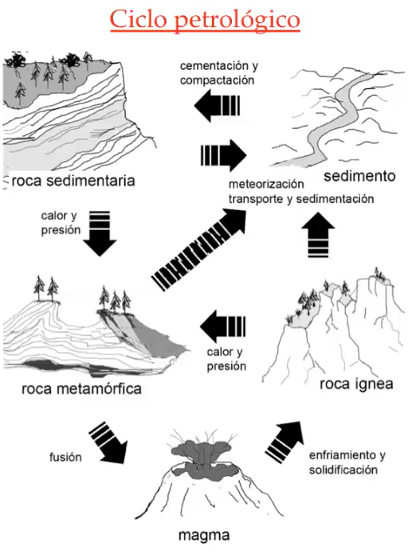
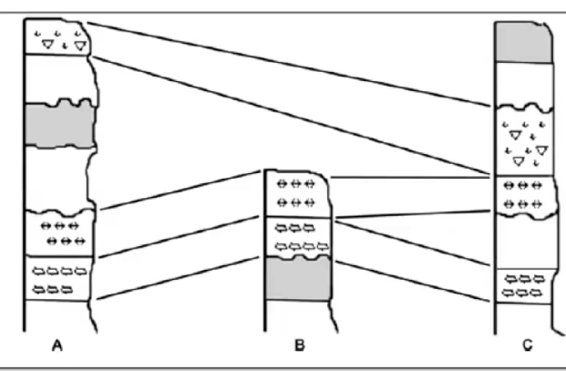

## Biogeografía 
El conocimiento y la interpretación de la distribución de las plantas y de los animales en las distintas regiones del globo.
La distribución de un animal está limitada por el entorno. 

- Distribución: ubicación existente 
    Limitada: area o tiempo,  comportamiento, interacción con otras especies, factores ambientales 
- Dispersion: es proceso q puede llevar a ampliar la distribución geográficamente 
## Biomas
asociaciones ecológicas en regiones amplias en regiones amplias terrestres o acuáticas
los factores de distribución van a afectar cómo se distribuyen los organismos en los diferentes biomas
- Acuaticos: lagos, rios, oceano pelagico, oceano bentonico.
- Terrestre: El clima Ejerce una acción limitante sobre la vegetación que va a ser característica de cada Bioma. Ejemplos: Pradera, desierto, selva tropical, sabana. 

### Regiones biogeográficas
- Neártica
- Neotropical
- Etiópica
- Oriental
- Australiana
- Antártica

Fenómenos planetarios que han determinado la distribución geográfica de los organismos
- Deriva continental: Es el movimiento de las placas tectónicas. Nos explica los pasados comunes de especies de regiones distintas.
- Cambios climáticos: Generan un cambio en las condiciones que favorecen u obstruyen algunos tipos de adaptaciones o estrategias
- Procesos tectónicos: Los procesos tectónicos ocurren de manera constante produciendo alteraciones.
- Eventos catastróficos: Es un evento impredecible en el ecosistema -> motor de la deriva génica

**Factores que determinan la vida en la tierra**
Los factores fundamentales para que haya vida en la tierra son la ==temperatura== (promedio) y la disponibilidad de ==agua== precipitaciones prom (h2o liq)
**Bioma**: Un conjunto de organismos con patrones comunes de clima y con vegetación distinta distribuida en una amplia área. Un bioma es una clase o una categoría, no es un lugar. El bioma está definido por características que se relacionan con temperatura y agua
Lo que mejor describe a un bioma son las plantas que ahí crecen (las mas condicionadas por temp y agua). La caracterización de un bioma se hace en base a la flora dominante en el área, a la que también hay asociada una fauna (esta no define al bioma).
Ayuda a predecir las interacciones

Hay 4 grandes categorías de biomas
- Bosques
- Sabanas
- Pastizales
- Desiertos: gran amplitud termica intradiaria (a diferencia de la tundra que es estable)

también hay biomas acuaticos (dulceacuic, marinos)
un bioma es un tipo de ecosistema

Regiones biogeográficas
Es la mayor división de la superficie de la tierra que se basa en la evolución histórica y los patrones de distribución de las plantas y los animales. Son grandes extensiones de la superficie terrestre donde las plantas y los animales se desarrollan en relativo aislamiento durante largos periodos y estuvieron separados unos de otros físicamente por ciertas características geológicas.
Lo que mejor describe a las regiones biogeográficas es la fauna. Paleontología Ciencia que estudia el pasado de la vida de la tierra a través de fósiles.
La fosilización es muy rara. Se produce cuando un organismo queda aislado de los detritívoros, tapados con sedimentos, convertidos en piedra y llevados nuevamente a la superficie.
Hacen falta muchas condiciones, en algunos casos excepcionales, para que un objeto orgánico se fosilice.

## Paleontología
Ciencia que estudia el pasado de la vida de la tierra a través de fósiles.
**Fósil:** resto biológico que sufre una transformación química, muchas veces el material es reemplazado y queda la impronta (forma). Asociado al origen de las rocas sedimentarias
La fosilización es muy rara. Se produce cuando un organismo queda aislado de los carroñeros y detritívoros, tapados con sedimentos, convertidos en piedra (CaCO3, CaPO3, SiO2) y llevados nuevamente a la superficie.
Hacen falta muchas condiciones, en algunos casos excepcionales, para que un objeto orgánico se fosilice.
Es mas comun que se produzca en lagos que en rios por el menor movimiento que permite la formacion de una roca sedimentaria. 
Busqueda: lugares con rocas sedimentarias sin vegetacion (alta erosion deja descubierto fosiles )
### Importancia
clasificacion evolutiva y taxonomica, construccion de arboles filogeneticos

### Tipos rocas

#### Ígneas
enfriamiento y solidificación del magma o lava.
#### Metamórficas
otras rocas sometidas a alta presion o temperatura
#### Sedimentarias
meteorizacion y transporte de sedimentos de otras rocas, forma diferentes estratos

### Estratigrafía
Disciplina geológica, vinculada a la paleontología, estudia la forma disposición, relaciones temporales de las capas de las rocas. 
Es el estudio de la superposición de capas o estratos de la tierra en el terreno con una finalidad arqueológica.
La materia orgánica se encuentra en el perfil de suelo. Lo que yo defino como suelo es el estrato donde se encuentra la materia orgánica.
Es mecesario que afloren las capas que estuvieron enterradas
#### Principios de steno
- Superpocision: estratos mas antiguos en la base (abajo)
- Horizontalidad: influencia gravitacinoal
- Continuidad lateral: hasta algun limite, todos 

#### Cuadros geocronologicos
Indican las especies que habitaron las especies terrestres en distintos momentos, de acuerdo en los las posiciones que fueron encontrados en los estratos, se determina el tiempo por radioisotopos

#### Correlacion de estratos

correlacionando distinos lugares en los que se encuentran los mismos fosiles en los mismos estratos, se puede estimar la cronologia, a partir de una zona de referencia.