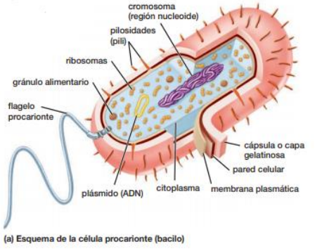
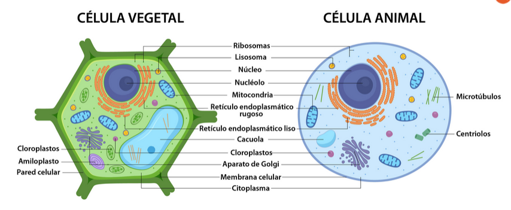
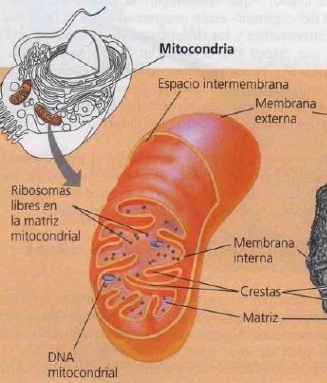
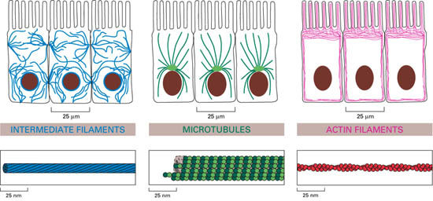
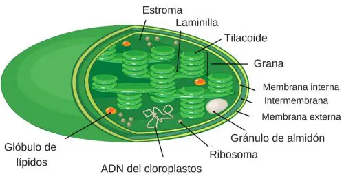

# Célula procariota
tamaño: >5um
Orgánulos: componentes internos sin doble membrana
- Sin sistema de endomembranas (vesiculas con bicapa lipidica)
- DNA: en nucleoide sin separacion membranosa, 1 solo cromosoma circular
- Pared celular: estructura de contencion y soporte-> les dan forma (cocos, bacilos, etc)
- Apéndices: flagelo (látigo)-> movimiento, pilis -> adhesion y intercambio genetico
- Ribosomas sueltos en el citoplasma

# Celula eucariota

##  Estructuras comunes
Reinos animal, vegetal, hongos
Ribosomas: Síntesis de proteínas (traduccion del ARN), libres o asociados al RER. Tienen 2 subunidades diferentes a las de ribosomas procariotas. 
### Organelas
Sistema de endomembranas, rodeadas por bicapa lipidica
- Nucleo: 
	- Delimitado por envoltura membranosa con poros -> selectivamente permeable
	- ADN organizado en 1 o + cromosomas
	- Nucléolo: región de cromosomas -> síntesis ribosomas (ARNr + proteinas)
- Retículo endoplasmático: red de membranas y sacos. 
	- Liso (REL): sintesis de lipidos ( cels secretoras de hormonas), desintoxicación química (cels hepaticas), regulación del Ca2+ (musculos, neuronas).
	- Rugosos (RER): sintesis de[ proteinas de membrana](Membrana_transporte#Tipos) o de exportación. Medio interno oxidativo --> plegamiento proteínas. Son marcados con glucidos -> glicoproteinas
- Sistema golgi: modificacion pos-traduccional de proteinas, clasificacion y transporte mediante vesiculas. Destino: membrana, secreción.
  Recorrido de las vesiculas: RER --> cara cis --> golgi --> cara trans
- Mitocondrias: respiracion celular con produccion de ATP, contiene su propio ADN y ribosomas. proceso catabolico
- Lisosomas: vesicula con enzimas hidroliticas que degrada y recicla nutrientes descartados.

### Citoesqueleto
- **Microtúbulos**: composicion tubulina. estructura 9+2 (9 pares externos y 2 centrales ) el desplazamiento entre un tubo y otro con gasto de ATP permite el movimento en cilios y flagelos (cola del espermatozoide), andamios de transporte intracelular, movimiento de los cromosomas en divison celular. 
- **Microfilamentos**: filamentos de actina -> prolongaciones del citoplasma. fn: forma y soporte (microvellosidades intestinales), motilidad celular (seudopodos)
- **Filamentos intermedios**: queratina, anclaje del núcleo y organulos.

## Estructuras exclusivas
### Plantas-Hongos
#### Pared celular
proporciona estructura, sostén.
	- Hongos: composición quitina
	- Plantas:  composición celulosa + otras proteinas
#### Cloroplastos 
(vegetal): 2ble membrana, dna y ribosomas propios. Fotosíntesis: proceso anabólico-> captación de energía para fijar CO2 en carbohidratos.

#### Vacuola
no es exclusiva, pero es mucho mas grande y con mas funciones (almacenamiento, estructura, neutralizacion de desechos)

### Animal
Centrosoma: centro organizador de microtúbulos. En el centrosoma de una célula animal hay centriolos que colaboran en la organización del ensamblaje de microtúbulos.
Matriz extracelular: estructura gelatinosa entre las celulas con proteinas como colageno. Funciones: soporte, regulacion.