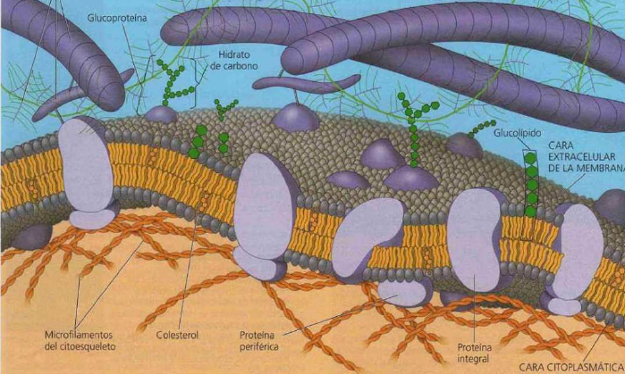
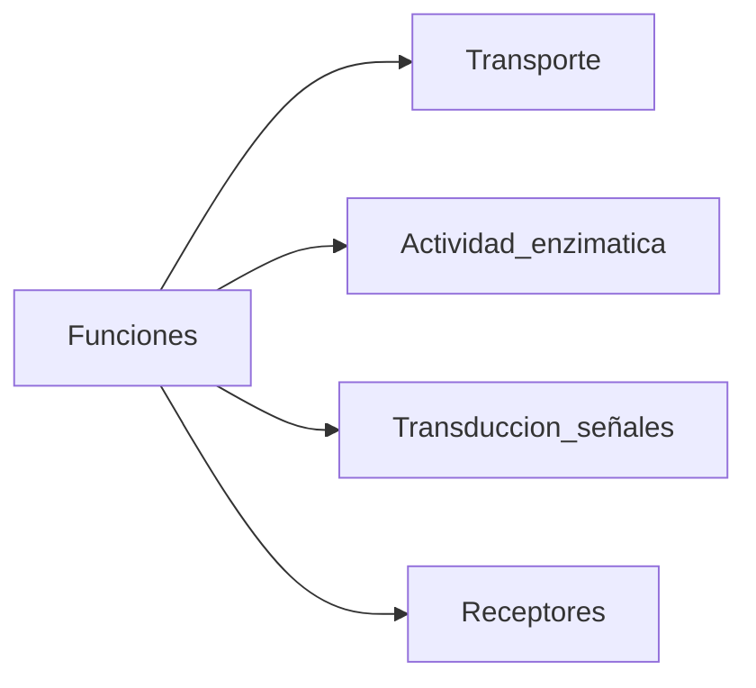
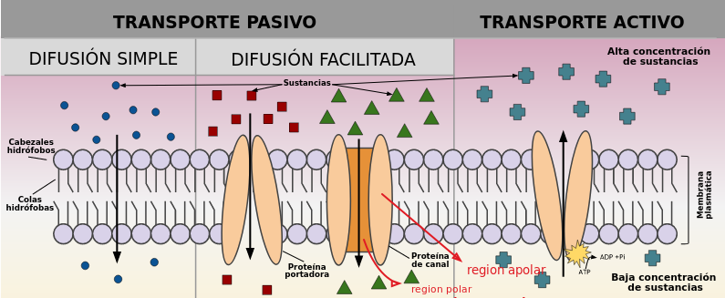

# Membrana celular
Sigue un modelo de mosaico fluido. Es una bicapa fosfolipidica fluida, es decir las proteínas embebidas en la matriz se pueden desplazar. Posee colesterol intercalado,si hay aumento de colesterol disminuye la fluidez de membrana. 
ver: 

## Proteínas
### Tipos
- Proteínas integrales: son transmembrana penetran la región hidrófoba central de la bicapa lipídica. Generalmente están enrolladas en forma de hélices α.
- Proteínas periféricas: no están embebidas en la bicapa lipídica; son apéndices unidos débilmente a la superficie de la membrana, a menudo a las partes expuestas de las proteínas integrales. Funcion: anclaje citoesqueleto, transducción  señales acopladas a las integrales.
- Glicoproteinas: con extremo de hidratos de carbono, función protectora
### Funciones (integrales)

## Tipos de transporte
### A través de membrana

#### Transporte pasivo
Es la difusión de una sustancia a través de la membrana siguiendo un gradiente de concentración. No hay gasto de energía por parte de la célula. Solo moleculas pequeñas: O2, CO2
#### Difusión facilitada
Permite el paso de solutos que no pueden atravesar la region hidrófoba de membrana lipídica. La parte externa de las proteinas es apolar para interactuar con las colas hidrofobas y la parte interna es polar para que pasen los solutos hidrofilicos polares.
Movimiento a favor del gradiente de concentración sin gasto de energía
- Proteina de canal: sin cambio conformacional, siempre abiertas. Ej: acuaporinas, canales ionicos
- Proteinas transporatadora: se abren con presencia del sustrato -> cambio conformacional.  Ej: glut (transporte de glucosa)
#### Transporte activo
Transporte activo: se utiliza energía para mover los solutos en contra de sus gradientes de concentración. Se lleva a cabo por proteínas transportadoras llamadas bombas. El ATP proporciona la energía para la mayor parte del transporte activo.
Ej. bomba de Na-K

----------
### Transporte masivo
#### Exocitosis
la célula secreta macromoléculas mediante la fusión de vesículas con la membrana plasmática.
#### Endocitosis
la célula incorpora macromoléculas y materia en forma de partículas
formando nuevas vesículas a partir de la membrana plasmática. Hay varios tipos de
Endocitosis: la fagocitosis, la pinocitosis (se incorpora algo en solución) y la
Endocitosis mediada por receptores (se incorporan cantidades masivas de sustancias
específicas)

# Uniones intercelulares
## Células vegetales
Plasmodesmos: Son perforaciones de la pared celular y comunican los ambientes químicos de células
adyacentes. Están revestidas por las membranas plasmáticas de las células adyacentes
## Células animales
 - Estrechas: quedan muy unidas en todo el borde, generando impermeabilización (no pasa nada por el medio), ej: epitelio intestinal
 - Desmosomas: son como remaches, unión muy fuerte pero mas puntual. 
 - Hendidura (gap): tubos de comunicación rápida de moléculas, ej: musculo cardíaco

# Transporte masivo
Exocitosis: la célula secreta macromoléculas mediante la fusión de vesículas con la
membrana plasmática.
Endocitosis: la célula incorpora macromoléculas y materia en forma de partículas
formando nuevas vesículas a partir de la membrana plasmática. Hay varios tipos de
Endocitosis: la fagocitosis, la pinocitosis (se incorpora algo en solución) y la
Endocitosis mediada por receptores (se incorporan cantidades masivas de sustancias
específicas)