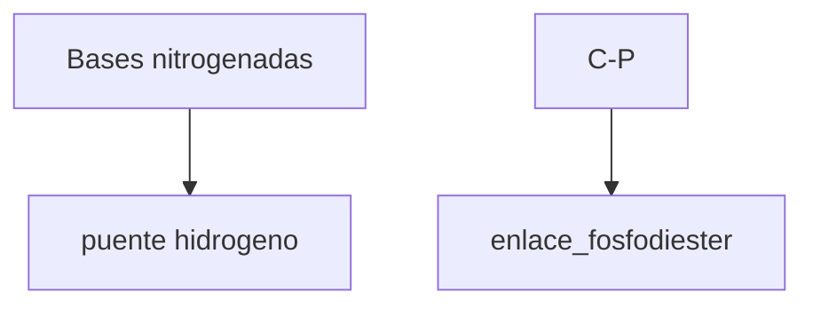
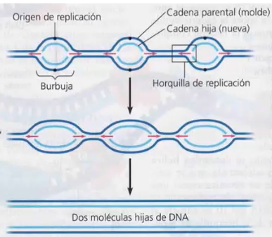
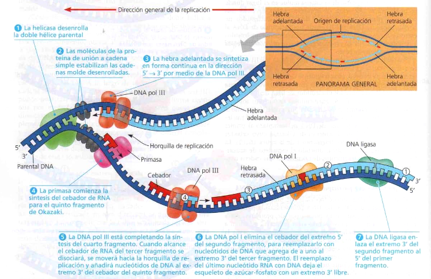
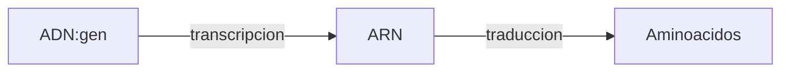
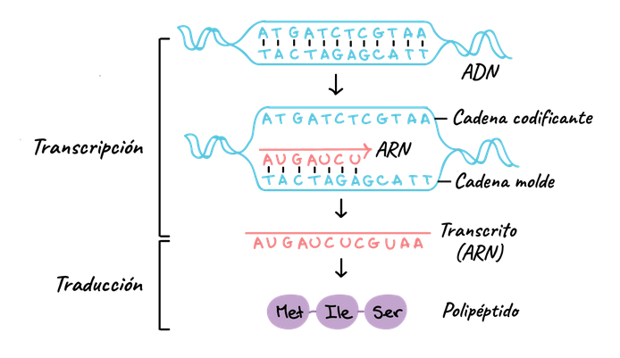
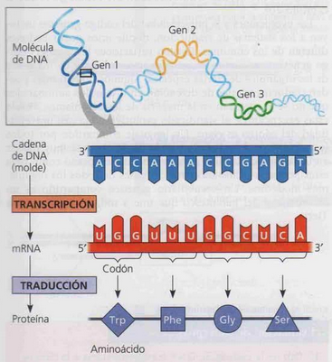
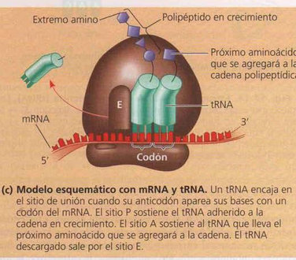
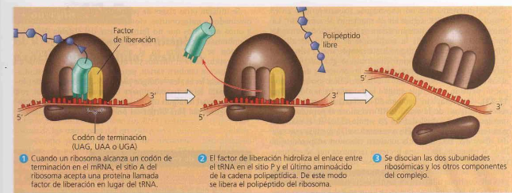
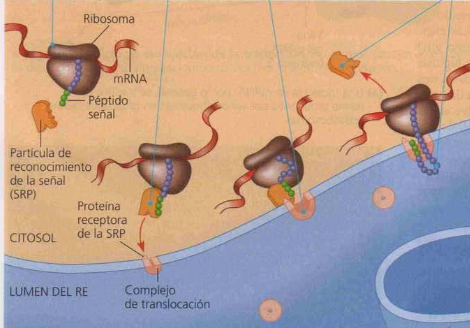

	# ADN
## Conceptos
ADN compuesto por secuencias de nucleótidos, algunas secuencias de nucleotidos codifican proteínas y otras no.
Los ==**genes**== son los fragmentos que codifican para una proteína.
Estructura: doble hélice con polaridad inversa (antiparalela)
Enlaces
Puentes de hidrógeno entre bases nitrogenadas: débiles -> replicación, duplicación

## Replicacion
- Momento de ocurrencia: Cuando se va a dividir la célula -> Fase S (síntesis). 
### Origen
- En eucariotas ocurre en varios puntos a la vez, llamados **horquillas de replicación**, esto debido a la longitud del ADN. 
- En procariotas se forma una sola horquilla y se replica por completo, ya que el adn es mas corto.

### Proceso

La helicasa rompe los enlace puente hidrógeno separando las hebras del ADN
La topoisomerasa estabiliza y evita el sobre enrollamiento del ADN
La RNA primasa sintetiza un cebador de ARN (primer) para la DNA polimerasa
La DNA polimerasa III sintetiza polímeros de ADN y coloca los nucleótidos catalizando la
reacción de unión entre ellos.
La DNA polimerasasa I escinde los nucleotidos de ARN y los reemplaza por ADN ()
La DNA ligasa arma las uniones covalentes entre los nucleótidos que quedaron separados
en la replicación por tramos.

La ADN polimerasa siempre se aleja del extremo 3’ de una hebra de ADN original y siempre se
agregan nuevos nucleótidos al extremo 3’ de la hebra hija. Esto implica que la replicación en
una de las hebras será continua (hebra líder) y, en la otra, discontinua (hebra rezagada).

	Resultado: cadena con hebra original + hebra nueva = modelo semiconservativo

## Dogma central biologia molecular

## Transcripción
El ADN codifica la síntesis de muchos tipos de ARN, tres de los cuales cumplen funciones específicas en la síntesis de proteínas: ARN mensajero (ARNm), ARN ribosómico (ARNr) y ARN de transferencia (ARNt).
El promotor es una secuencia de ADN que tiene adosadas proteínas (factores de transcripción) y le indican a la RNA polimerasa (según su ubicación) dónde y hacia qué lado colocarse.
### Procariotas
- **Inicio transcripción** --> Promotor (TATA box) + ARN-Pol
	`Las T y A repetidas tienen doble enlaces que se separan mas facil que los 3 en GT`
- **Elongación**:  La ARN-pol separa las dos cadenas (burbuja de transcripción) y avanza en dirección 5' -> 3'
- **Terminador**:
	- secuencias de ARN transcriptas -> horquillas de terminación (estructuras 2darias)
	- factor rho: reconoce secuencia de ARN y se desplaza hasta la ARN-Pol para desrprenderla

### Eucariotas
- Inicio transcripción --> Promotor (tata box) + **factores transcripción** (FT)+ ARN-Pol 
- Elongación: idem
- Terminador: señal de poliadenilacion (secuencia de nucleotidos del adn), proteinas de los FT separan el pre-ARNm
#### Procesamiento del ARNm
![[Pre-mRNA.svg.png]]

En **procariotas no hay procesamiento**, los ribosomas ese pegan al ARN mientras se va transcribiendo y lo comienzan a traducir
En **eucariotas** las RNAsa en citoplasma destruye el RNA. Por eso se modifica:
- Se le agrega un capuchón de guanina trifosfato (casquete 5' o caperuza) que impide impide el reconocimiento
- Se le agrega una cola poli A (adenina) para retrasar la degradación del ARN.
Las regiones UTR: (untranslated regions) no codificantes
Lo que se transcribe no es necesariamente la información correcta. El RNA está compuesto de ==exones e intrones==. 
Los exones poseen la información del gen y pueden salir del núcleo de la célula, mientras que los intrones no aportan información. 
Conversion del pre-ARNm a ARNm: Los exones e intrones están alternados para evitar mutaciones. Luego los intrones se cortan (splicing), se unen los exones y el ARN queda listo para codificar una proteína. 
El corte y empalme es realizado dentro del nucleo por el ==epliceosoma== (conjunto de enzimas)

Eucariotas: transcripcion en el nucleo, traduccion citoplasma
Procariotas: todo en citoplasma, con arn policistronico (produce mas de una proteína)

## Traducción
### Ribosoma
- Composicion: 2 subunidades proteinas con ARNr
- Función: traduccion -> reconoce tripletes del ARNm y genera la cadena de aminoacidos correspondiente

### Código genético
 - Es unívoco: Cada codón sipemre codifica el mismo aminoácido.
 - Es redundante: Hay varios codones que llevan al mismo aminoácido
 - Es universal: Todas las células utilizan el mismo código genético
Codones: conjunto de tres nucleótidos del ARNm que determinan un aminoácido
Anticodón: complementario al codón en el ARNr
AUG: codón de inicio. Todas las proteínas arrancan con metiodina
UAA; UAG; UGA: codones de finalización. No tienen un aminoácido asociado por lo que
no se puede enganchar otro codón.
Para la síntesis de proteínas actúan las dos subunidades del ribosoma

### Modelo traduccion

Sitio A-> reconocimiento del aminoacido
Sitio P-> uinio peptidica con gasto de GTP
Siio E-> exit del ARNt, el ARNt liberado se vuelve a cargar con su aa con gasto de ATP
Terminacion: cuuando se llega al codon de terminacion se une un factor de liberación en vez de ARNt

### Señalización
La traduccion siempre empieza en el citoplasma, si la secuencia de aa forma una ==peptidoseñal== una partícula de reconocimiento (SRP) se une al ribosoma y lo lleva al RER para terminar la traduccion y liberar el polipeptido al interior del lumen .

## Mutación
Es un cambio en la secuencia de bases del ADN que suele dar por resultado un gen defectuoso, modificacion heredable.
### Mecanismos
- Sustitución: un par de nucleótidos es totalmente cambiado
- Supresión: un par o más de nucleótidos es eliminado de la secuencia, suele dar cambios en el marco de lectura --> gran variacion en el producto
- Inserción: un par o más de nucleótidos es insertado a la secuencia
- Inversión: una sección del ADN se corta, se invierte y se reinserta en el espacio
- Translocación: se remueve un segmento grande de ADN de un cromosoma y se reinserta en otro cromosoma
### Según región
#### En región codificante
![[Pasted image 20240726165313.png]]
*conservativa = silenciosa
#### En region no codificante
##### Con efecto
- Regiones promotoras: puede afectar la expresion disminuyendo o aumentando
- En secuencias de regulacion post-traduccional (regiones UTR del ARNm)
##### Sin efecto
- Intrones: en general no afecta al eliminarse en el splicing