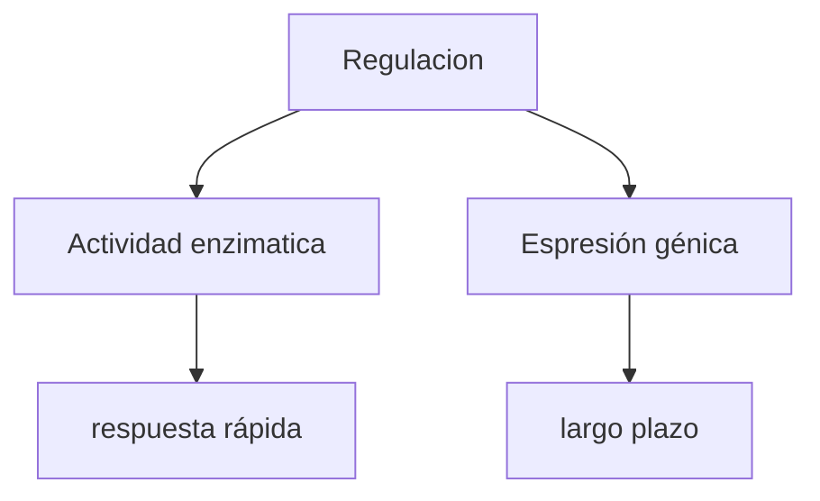
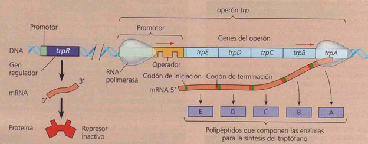
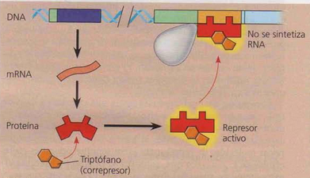
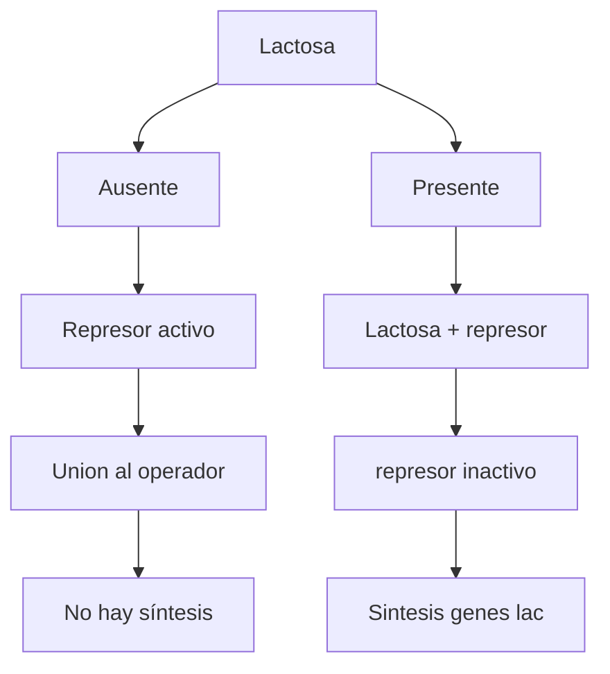
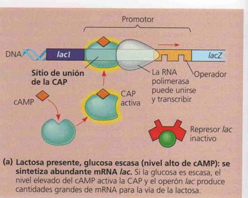

# Regulación génica procariota
## Regulación negativa
Incluye la interacción de una proteína represora sobre el operador, una región del ADN superpuesta con el promotor, que es donde se debe unir la ARN-pol. Si el represor está en el operador la polimerasa no puede unirse y transcribir para expresar los genes del operón. 
### Operón reprimible
- Gen regulador-> proteina represora
#### Sin triptófano
La ARN pol se une al promotor normalmente, reconociendo la caja TATA -transcripción-> ARNm -traducción-> enzimas => producción de triptofano

#### Con triptófano
triptofano en exceso -unión-> proteína represora -unión-> operador => represión de la expresión génica

### Operón inducible
Operón lac, la presencia de lactosa desactiva el represor permitiendo que se expresen los genes necesarios para degradar la lactosa en glucosa y galactosa.

## Regulación positiva
La proteína reguladora (CAP en el ejemplo), promueve que la ARN-pol se una con mayor fuerza y continuidad para expresarse en mayor cantidad.

# Biología molecular
## Plásmidos recombinantes
Plasmidos de bacterias, se pueden extraer, modificar, reintroducir en la bacteria, multiplicacion de la población bacteriana para expresar en gran cantidad el gen de interés. Por ej produccion de hormonas de crecimiento. 
El gen se inserta en el plásmido usando enzimas de restricción --> esta corta el plásmido --> el gen debe tener secuencias en común coon el plásmido que son las secuencas que corta la enzima, para que luego se unan por complementariedad. 
Usos: insertar plásmidos que permitan sintentizar proteinas de interes (ej: insulina, hormona de crecimiento)

## PCR
Amplificacion de un segmento de ADN por replicacion ciclica.
![[PCR_pasos.jpeg]]
## Secunciación
Incororación de nucleótidos marcados que cortan la sintesis, luego se puede deducir la secuencia de nucleótidos del ADN.