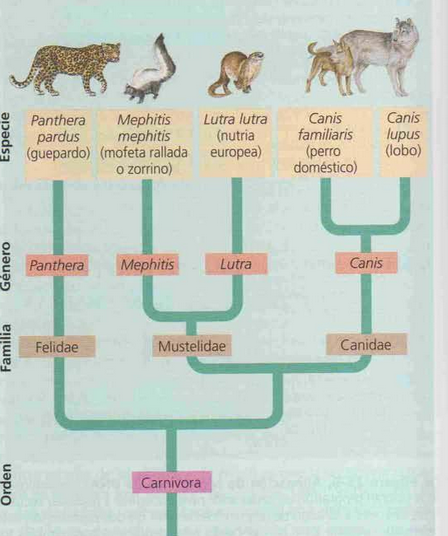

conceptos de especie -> aislamiento reproductivo
# Definiciones de especie
## Especie biológica
Población o grupo de poblaciones cuyos miembros tienen el potencial
de entrecruzarse en la naturaleza y producir descendencia viable y fértil, pero que no son
capaces de producir descendientes viables y fértiles con miembros de otras poblaciones
## Especie evolutiva
es un linaje de poblaciones u organismos que mantienen su identidad de
otros linajes y que poseen sus propias tendencias históricas y evolutivas
## Especie morfológica
cada especie se distingue de sus afines por su morfología (fenotipo)
## Especie filogenética
cualquier grupo de organismos en el cual todos comparten un único carácter derivado (**sinapomorfía**)
## Especie ecológica:
es un linaje o conjunto de linajes cercanamente relacionados, que
ocupa una zona adaptativa mínimamente diferente en su distribución de aquellas
pertenecientes a otros linajes, y que además se desarrolla independientemente de todos
los linajes establecidos fuera de su área biográfica de distribución.
# Niveles de biodiversidad
## Genética
Diferentes alelos en una población, diferentes expresiones del mismo gen.
## Especies
cantidad de especies diferentes que interactúan entre si en ecosistema
## Ecosistema
diferentes ecosistemas cada uno con sus poblaciones y las interacciones entre ellos
# Clasificacion especies
se tiene en cuenta:
## Filogenia
historia evolutiva clasificación por registros fósiles, pruebas C, correlaciones.
### Estructuras homologas
origen evolutivo comun, pueden tener diferentes funciones y formas
ej elementos esqueleticos (radio, humero)

### Estructuras análogas
funciones similares pero no tienen un origen común, son el resultado de una ==convergencia evolutiva==
ej: alas de insectos, alas de aves.
## Sistemática
Clasificacion evolutiva y de diversidad con analisis morfologicos y bioquimicos
### Uso de sistemática molecular
aprovechando la bioinformática haciendo comparaciones de secuencias de nucleótidos de ADN y ARN.
permite establecer grados de parentesco de acuerdo a similitudes, en largos periodos evolutivos.
las modificaciones son producidas por mutaciones indels (inserciones y deleciones)

1. Los segmentos de DNA . homologos ancestrales son identico cuando la 2 especie 1 y la especie 2 tomienzan a divergir de su ancestro comun
2. Mutaciones van cambiando las secuencias
3. no todas las regiones quedan homologas
4. las regiones homologas se realinean (software) dejando espacios 
- **Homoplasia molecular**: genes coincidentes por azar, se deben detectar paara descartar falsos parentescos

## Sistemática filogenetica (taxonomia)
Ordena la clasificacion con la historia evolutuva
- Categoría: nombre de clasificación (especie, genero, familia)
- Taxón: nombre especifico (Homo sapiens, Homo, Hominidos)
### Arbol filogenetico
conecta los individuos con sus antecesores comunes

La longitud de las ramas y sus ramificaciones indican los cambios evolutivos, el guepardo tuvo menos divergencia evolutiva que los otros grupos, el antecesi de mustelidae aparecio antes que el antecesor de canis

### Grupos fileticos

- Monofiletico: antecesor comun y todos sus descendientes, conforman un ==clado==
- Polifilético: grupo que contiene diferentes grupos con diferentes antecesores
- Parafiletico: grupo con antecesor comun, que deja otros descendientes afuera

# Dominios

- Bacteria: procariotas. ARNr con vol de sedimientacion 16s (subunidad menor)
- Archea: procariotas especializados en ambientes extremos. ARNr 16s
- Eucaria: desprendidos de archea con endosimbiosis de bacteria. ARNr 18s
	 Reinos: hongos, protistas, plantas, animales	 
> Todos los dominios se pueden diferenciar por variaciones en los ARNr que son estructuras muy conservadas

## Origen endosimbiotico de las organelas
Organelas como mitocondrias y cloroplastos eran bacterias absorbidas por archeas, las organelas tienen su propio material genético que se replica de forma independiente del genómico. Los primeros eucariotas no tenian capacidad de metabolizar oxigeno para producir ATP.
La celula archea mas grande sería mas eficiente en la degradacion de alimentos, y la celula bacteriana en el metabolismo oxidativo del O2.

