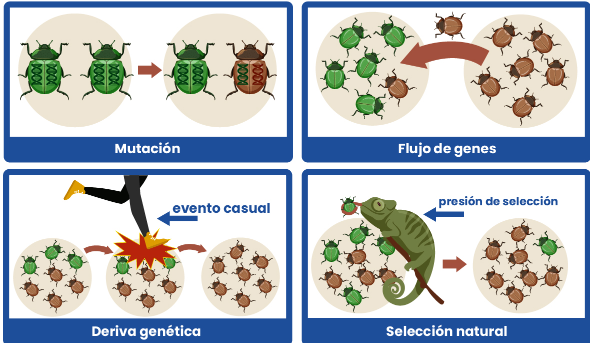

# Evolución
Cambio en la frecuencia alélica de una población
## Impulsada por

### Reproducción sexual
Por la unión de genes haploides + crossing over de cromosomas
### Mutación
Cambios en la secuencia de ADN que pueden generar características favorables, pueden deberse a errores de la ADN-Polimerasa (son mínimos xq tiene alta fidelidad) o alteraciones por mutágenos externos (físicos o químicos)

### Selección natural
Presión de selección del ambiente sobre las características favorables (generadas por la mutación) que van quedando fijadas.
[Detalles](1.1_Seleccion-natural.md)
### Deriva génica
Cambios en el [fondo génico](2_Genetica-poblaciones.md) debido a efectos aleatorios o impredecibles.
### Flujo génico 
Cambios en el fondo génico debido a inmigración o emigración de .
## Especiación
El efecto de la evolución es la aparición de nuevas 
### Patrones de cambio
#### Anagénesis
ana = nuevo, acumulación de cambios heredables
#### Cladogénesis
(klado = ramas) ramificación de nuevas especies desde un ancestro común, fuente de biodiversidad

### Influencia geográfica
En ambas opera la cladogénesis

#### Alopátrica
Forma una nueva especie al aislarse geográficamente, interrupción del flujo génico, no es necesaria la modificación geológica puede ser por colonización de área remota
#### Simpátrica
Especiación sin separación geográfica, puede producirse por reproducción no aleatoria, como la formación de tetraploides en plantas que quedan aislados reproductivamente.

## Cambios en el tiempo
### Microevolución
Cambios graduales dentro de la población (mismo reservorio génico). Ej: resistencia a sustancias toxicas, a condiciones fisicas, etc.
### Macroevolución
Cambios acumulados a lo largo de generaciones que produce la especiación. Tiene novedades evolutivas que define nuevos taxones. Ej: aparicion de plumas

## Direccionalidad
### Convergente
Evolución independiente de estructuras diferentes (==analogía==) que cumplen la misma función. Provienen de ancestros diferentes (marsupiales y placentarios)
### Divergente
Con ancestros común, estructuras homologas que se adaptan a diferentes funciones. Ej huesos de aves y humanos son los mismos pero cumplen diferente funcion

### Co-evolución
Dos o más especies interactúan entre sí y evolucionan en respuesta a la presión selectiva que ejercen mutuamente. Ej: colibri y flores -> exclusividad de alimento para colibri y efectividad de polinizacion para flores / parásito y huesped: coevolucionan los mecanismos de defensa y ataque.
