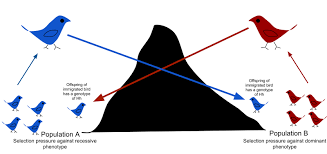
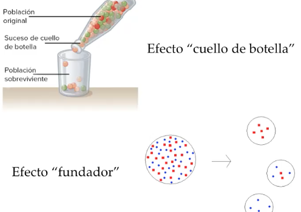
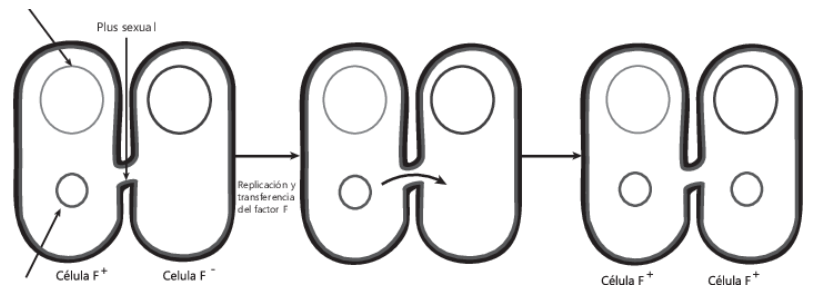

# Genética de poblaciones
## Fondo génico
También se le dice acervo, pool o reserva génica. Conjunto de todos los alelos diferentes de una población. 
En el ejemplo si además de los genes Ww, todos los individuos tuvieran solamente el gen homocigota AA 
el fondo génico sería: Ww, AA.
### Frecuencia alélica
Una de las características cuantitativas de la reserva génica

Las mutaciones pueden ir cambiando la frecuencia alélica

### Variaciones
#### Flujo génico
Migración de organismo que introduce nuevos alelos en una población generando cambios en el fondo genico y la frecuencia alélica.

#### Deriva génica
Cuando cambian las frecuencias alelicas por diferentes motivos, como:
- Efecto fundador: un grupo pequeño se separa en una nueva colonia
- Cuello de botella: reduccion drástica de la poblacion por eventos catastróficos
	elimina o reduce la frecuencia alelica de algunos genes que se terminan perdiendo. 
- Poblaciones aisladas: por eventos naturales o artificiales (separacion por nuevo rio)
- Fluctuaciones aleatorias: eventos aleatorios favorecen una frecuencia alelica determinada

## Transferencia lateral
Conjugacion bacteriana, transferencia de plasmidos es una modificacion genetica "no heredable", la replicacion del plasmido es independiente, y no siempre las celulas hijas reciben una copia.
La celula con el plásmido F+ genera pilis para atraer celulas F- y transferirle

