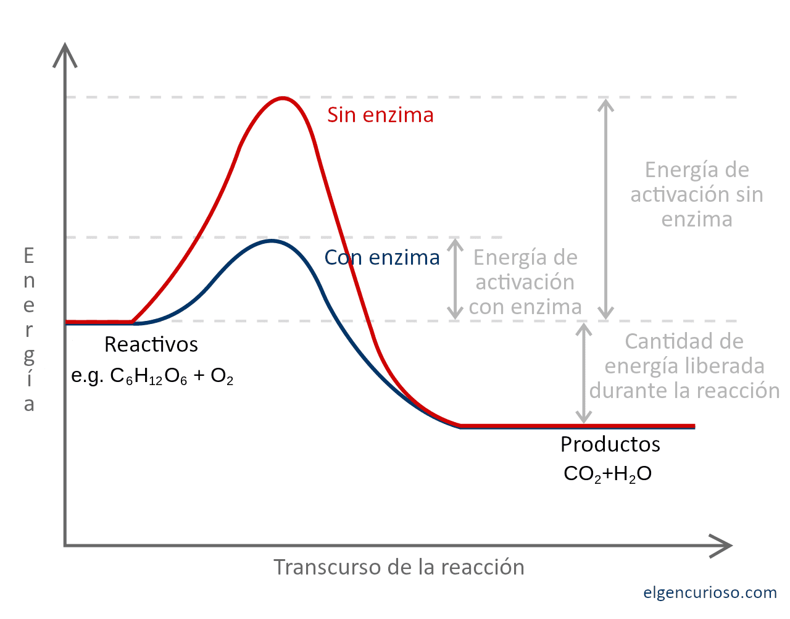
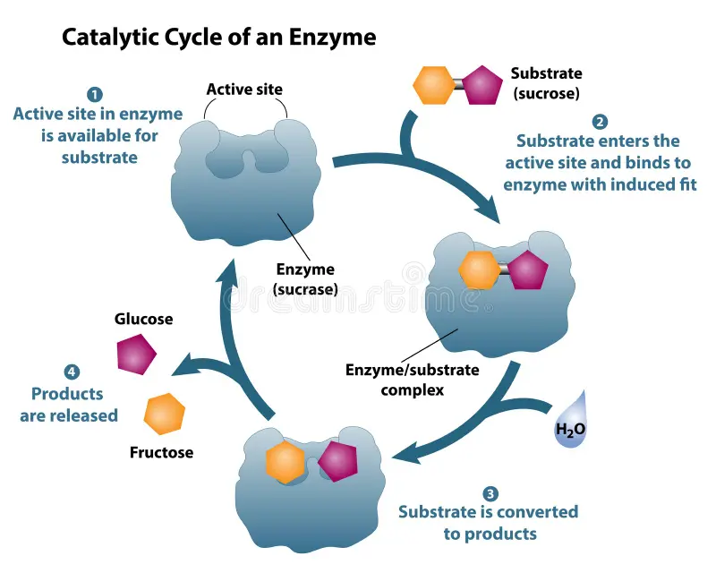
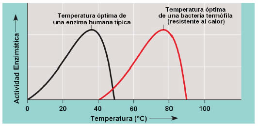
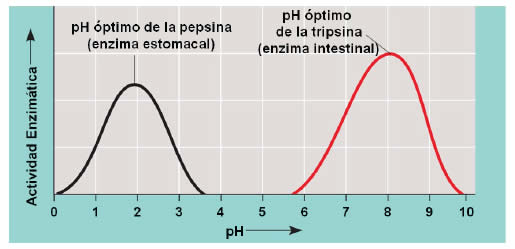
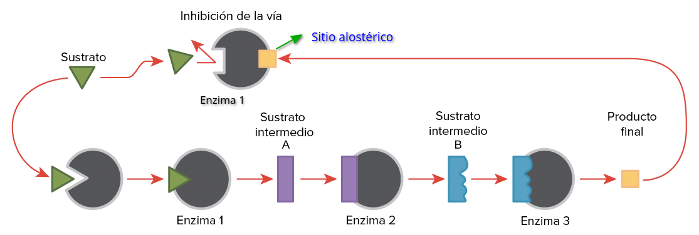

# Metabolismo
propiedad emergente de la célula que implica la totalidad de reacciones químicas.
## Vía metabólica
Todos los pasos de transformación de un sustrato en un producto, con reacciones intermedias catalizadas por enzimas

## Energía libre ΔG
### Reacciones exergónicas 
la reacción produce energía disminuyendo la energía libre de los productos
### Reacciones endergónicas 
inverso

## Perfil energético
energia libre de activación: aporte de energía externa para alcanzar el **estado de transición** necesario el para desestabilizar los enlaces
enzimas acoplan la energía producida por el ATP a procesos endergónicos que consumen esa energía.

# Enzimas
La union con un sustrato genera un cambio conformacional que favorece una reacción disminuyendo la energía de activación
## Sitio activo
El plegamiento tridimensional genera un **sitio activo** específico para ciertas moléculas que cataliza reacciones determinadas.

## Influencia de temperatura y pH

Cada enzima tiene una temperatura y pH óptimos, si aumenta o disminuye el factor ambiental (eje x) disminuirá la velocidad de reacción.
Es el principio de conservación de la comida en frío, ya que no permite las reacciones enzimáticas de los microorganismos 
La pepsina es estomacal está adaptada a funcionar en el ambiente ácido del estómago, y tiene un perfil muy diferente al de la tripsina (intestinal)

## Sitio alostérico
Sitio donde se une el producto generando un cambio conformacional que corta la via metabolica
Se produce una regulacion de inhibicion por retroalimentacion negativa

