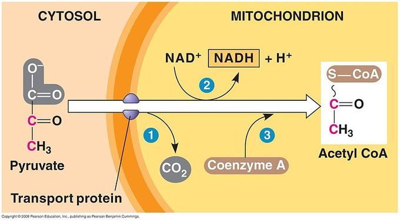

# Respiración celular
## ATP
Es la "moneda energética" porque se usa para transferir energia de diferentes reacciones, y de un lugar a otro. Nucleotido con base adenina y 3P.
El producto final de la respiracion celular será el ATP en un ciclo de varias vias metabolicas.
Se usa para:
- **Trabajo mecánico**: fosforilando proteinas motoras
- **Trabajo de transporte**: fosforilando proteinas de membrana para transporte en contra de un gradiente de concentración
- **Trabajo químico**: fosforilando reactivos clave

## Vías metabólicas

\* CTE : cadena transportadora de electrones

### Glucólisis
Ocurre en el citoplasma, cada paso esta catalizado por enzimas
El ATP producido en esta etapa es por ==fosforilación a nivel de sustrato== porque el P proviene de otra molécula orgánica.
#### Fases

#### Resultado neto

### Oxidación del piruvato

> Piruvato + coenzima A + NAD+ --> CO2 + AcetylCoA + NADH

### Cliclo de krebs

Por cada glucosa -> 2 piruvato --> 2 AcetilCoA --> 4 CO2 + 6 NADH + 2 FADH2 
> [!Poder reductor]
> El NAD+ y FAD+ (nad y fad oxidados) son nucleotidos que sirven para transportar electrones de alta energía como NADH y FADH (nad y fad reducido) que se usarán en la CTE

### Cadena transportadora de electrones (CTE)
La cadena transportadora permite que los electrones de alta energía sean cedidos al O2 para formar agua en una reacción exergónica controlada. De lo contrario la formación de agua es explosiva liberando energia de forma de descontrolada.
El O2 que es el mas electronegativo es el aceptor final de electrones de la cadena, que se reduce formando H2O. 
La energía liberada por pasaje de electrones por las proteinas transmembrana se usa para bomber H+ al espacio intermembrana formando un grandiente electroquimico por la alta concentracion de H+
==Fosforilación oxidativa== los [H+]  del espacio intermebrana pasan por la ATP-sintasa para generar ATP en un proceso de quimiosmosis. 

> RESULTADO: 32 ATP de 1 glucosa

### Vías alternativas
#### Con O2 disponible
Además de la glucólisis se pueden hidrolizar lípidos y proteínas para obtener piruvato, pero hay una fase de inversión energética mayor para en la descomposición de las macromoléculas
#### Sin O2
Se produce la glucólisis pero no ingresa al ciclo de krebs porque no hay NAD+, ni a la CTE por la ausencia de oxígeno
##### Fermentación láctica
Ej ejercicio físico intenso, el musculo se queda sin O2

##### Fermentación alcoholica
Ej levaduras

