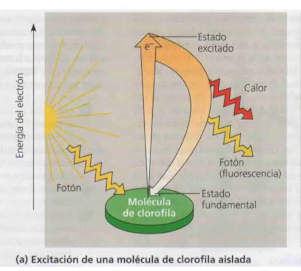
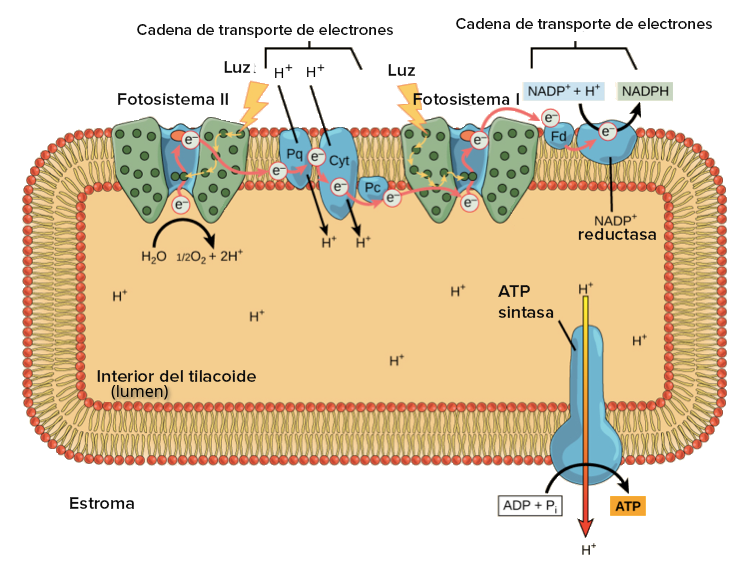
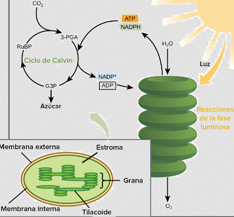

# Fotosíntesis
Formacion de moleculas orgánicas a partir del CO2 usando la energía luminica del sol

# Fases 
## Luminosa
En la membrana de los tilacoides del  se encuentra la clorofila que es un pigmento que tiene e- de baja energía que se exitan con los fotones pasando a alta energía liberando calor y fluorescencia cuando vuelve al estado fundamental

El oxigeno cede los electrones que se trasportan por la CTE usando la energia para bombear H+ el lumen del tilacoide y generando poder reductor.
El gradiente electroquimico de los H+ se usan para la síntesis de ATP

## Oscura (Ciclo de calvin)
Se usa el ATP y el NADPH para reducir el CO2 fijandolo en glucosa y otros compuestos orgánicos.
Luego esa glucosa se usa para generar energía metabolica en la respiración celular
