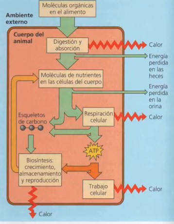
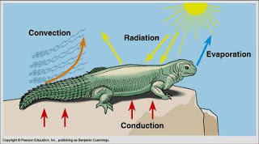
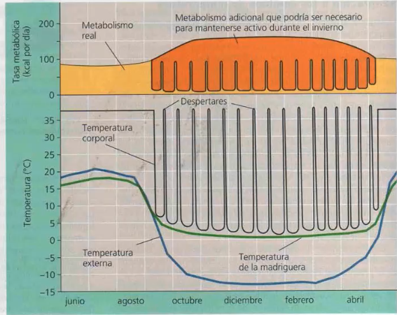

# El medio interno
El medio interno es lo que rodea la célula en un organismo multicelular regular
## Homeostasis
La homeostasis es un conjunto de procesos a través de los cuales un organismo mantiene su
ambiente interno dentro del estrecho margen de condiciones necesarias para el
funcionamiento celular óptimo ante un ambiente externo cambiante.
### Condiciones que se regulan
- Temperatura
- Concentraciones de sal y agua
- Concentraciones de glucosa
- pH (equilibrio de ácidos y bases)
- Concentraciones de oxígeno (O2) y dióxido de carbono (CO2)
### Importancia de la homeostasis
- **Necesidad de mantener los niveles de glucosa y oxígeno:**
La importancia de mantener estos niveles es que esas moléculas son con las que se va
a producir el ATP, que es la energía que se utiliza para mantener los procesos vitales
- **Necesidad de mantener el pH y la temperatura:**
La importancia de mantener regulado el pH es porque si el ambiente es muy ácido o
muy básico se rompen los enlaces de hidrógeno que la enzima utiliza para las
reacciones en la célula (se desnaturalizan las enzimas). Lo mismo ocurre su la
temperatura es muy elevada
- **Importancia de mantener la osmolaridad:**
La osmolaridad en el medio interno significa un equilibrio en las sustancias disueltas en
el citoplasma, con lo cual está estrechamente relacionado con la cantidad de agua. Por
lo cual si la osmolaridad aumenta, la célula se deshidrata.

### Retroalimentacion
Estimulo -> Receptor -> Centro control -> Efector
#### Negativa
El efector genera un cambio contrario al estimulo. Ej: 🔽 O2 -riñon-> 🔼 EPO -> 🔼 Eritrocitos 
#### Positiva
El efector genera un mecanismo que aumenta el estimulo. Ej: etileno en frutos climatéricos -> mas etileno
### Concentración de sal relativa al citoplasma
Isotónica: igual concentración que el citoplasma.
Hipertónica: más concentrada que el citoplasma. La célula se deshidrata.
Hipotónica: menos concentrada que el citoplasma. La célula se hincha.
Solución fisiológica: contiene sal
Hay células con modificaciones que favorecen la homeostasis

## Tejidos
### Epitelial
El epitelio es la última capa que se dispone sobre una membrana basal y delimita las cavidades
internas del organismo.
Se puede clasificar por:
### Cantidad de capas de células
 Si tiene una capa de células es simple
 Si tiene más de una capa de células es estratificado.
### Forma de las células de la última capa
 Plano o escamoso: células más anchas que altas
 Cúbico: células igual de altas que anchas
 Columnar: células más altas que anchas

### Tejido conectivo
Colabora a mantener todo en su lugar
- Hueso
- Cartílago
- Tejido adiposo
- Sangre
- Colágeno
### Tejido muscular
Las células musculares son fibras, es decir, son más largas que anchas
 Músculo liso: Fibras musculares desorganizadas (ayuda con la presión). Se contraen en todos los sentidos. Movimiento involuntario
 Músculo estriado o esquelético: Fibras musculares organizadas. Se contraen en un solo sentido. Permiten dirigir el movimiento. Movimiento voluntario
 Músculo cardíaco: Se parece al músculo esquelético por la organización de las células. No
se fatiga. Sus fibras están muy especializadas en la comunicación entre células
### Tejido nervioso
Neurona: es una célula muy especializada en transmitir un impulso (despolarizarse). Se puede
comunicar con otras células. Forma un tejido en el que estimula o no estimula. Tiene
prolongaciones de su membrana plasmática (axón) que pueden ser tan largas como la altura
del organismo.

# Temperatura
Mantener la temperatura es generar calor o perder calor. El cuerpo busca un equilibrio entre
la termogénesis y la termólisis.
## Ectotermos
su temperatura está determinada por fuentes externas de calor. Utilizan la
radiación, la conducción y la convección
## Endotermos
regulan ellos mismos su temperatura por metabolismo

## Mecanismos intercambio calor
- Convección: por movimiento de aire, regulado por vasodilatacion o constriccion
- Radiación
- Evaporación
- Conducción

## Adaptaciones
### Tegumento: 
conformado por epidermis + dermis con glandulas sudoriparas, sebaceas + hipodermis con tejido adiposo aislante. gran regulacion térmica
### Circulatoria
Intercambiadores de calor contracorriente, 

### Muscular
tiritacion, aumenta la creacion de calor
# Sopor
el organismo “prende” y “apaga” los mecanismos metabólicos para así poder subir o
bajar la temperatura. En general es llevado a cabo por organismos de poco tamaño. La
temperatura corporal baja tanto que prácticamente iguala la temperatura ambiente
Hibernación: la hibernación es un sopor prolongado.
ej: temperatura y metabolismo de ardillas
