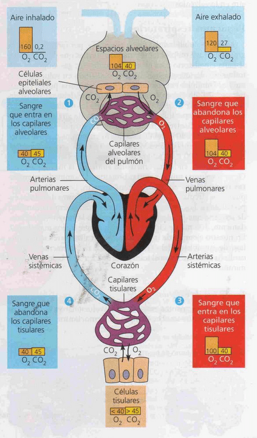
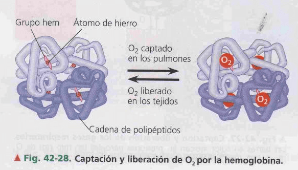

# SISTEMA CIRCULATORIO
## Vasos circulatorios
las arterias salen del corazón y las venas llegan al corazón.
Las arterias soportan una presión mayor que las veas gracias a que poseen una capa muscular extra.
Las venas poseen válvulas para evitar el retorno de la sangre
- Circulación menor: Corazón -> Pulmón -> Corazón
- Circulación mayor: Corazón -> resto del cuerpo -> Corazón

Hay partes del cuerpo como en extremedidades en las que el musculo esquelético actúa como **bomba muscular**, al contraerse comprimiendo las venas ayudan al retorno de la sangre 
## Capilares
Los capilares son la bifurcación más pequeña a la que llega un vaso sanguíneo. Es tan pequeña que los glóbulos rojos pasan de a uno y apretados. Es donde se produce el intercambio gaseoso (a nivel alveolar y a nivel tisular)
-  Capilar arterial
- Capilar venoso
La sangre va desde el capilar arterial hacia el capilar venoso
## Hematosis
proceso de intercambio de gases en la respiración pulmonar
-  Transporte de CO2 desde los tejidos hacia los glóbulos rojos:
La hemoglobina fija CO2 y toma un protón de H2CO3 dando como resultado bicarbonato HCO3-
- Transporte de CO2 desde los glóbulos rojos hacia los pulmones (la mayor parte transportado como HCO3- en plasma por eso no aumenta varia tanto a concentracon del co2)
El CO2 difunde hacia el pulmón, la hemoglobina suelta el protón, que se une al bicarbonato nuevamente, dando H2CO3, este se separa en CO2 y H2O y finalmente el CO2 difunde hacia los alveolos por un gradiente de concentración.
La sangre escurre por los vasos sanguíneos, estos pueden formar un circuito cerrado o uno abierto.
### Esquema

### Esquema presion parcial de gases

Hemoglobina presente en los eritrocitos,  la afinidad del Fe con el O2 permite transportarlo
En los tejidos la baja [O2] y el menor pH hacen que la hemoglobina libere el O2 y capte el CO2

### Circulatorio en vertebrados

#### Peces
Corazón bicameral: 1 Aurícula y 1 Ventrículo
### Circuito cerrado
la sangre siempre viaja contenida por un vaso, lo que permite que el medio interno y la sangre estén separados.
### Circuito abierto
tenemos una hemolinfa donde la sangre se mezcla con el medio interno. La sangre se vuelca en senos linfáticos (hemosenos) y luego es intubada y llevada al corazón.

### Corazón
es el órgano pulsátil, que se encarga de movilizar la sangre contenida en los vasos. Está formado por al menos dos cámaras, aurícula y ventrículo. La aurícula recibe la sangre, la pasa al ventrículo y de ahí se expulsa al resto del cuerpo
Hay corazones de 2 camaras, 3 cámaras (2 aurículas y 1 ventrículo) y de 4 cámaras (2 aurículas y 2 ventrículos)
El músculo cardíaco tiene la capacidad de conducir impulsos que conectan las células entre sí, esta capacidad le permite coordinar la contracción para vaciar la cavidad
### Ciclo cardíaco
Durante cada ciclo, las dos aurículas se contraen primero en sincronía para vaciar su contenido en los ventrículos. Luego, los dos ventrículos se contraen de manera simultánea obligando a que la sangre pase a las arterias que salen del corazón. Después las aurículas y ventrículos se relajan brevemente para comenzar el ciclo nuevamente
La contracción del corazón se inicia y coordina por un marcapasos, que es un grupo de células especializadas del músculo cardiaco que produce señales eléctricas espontáneas a un ritmo regular. El marcapasos cardiaco es el nodo sinoauricular (SA), localizado en la pared superior de la aurícula derecha.
Las celulas del corazon funcionan como un sincitio (coordinadas)
Primero, el nodo SA inicia una onda de contracción que pasa por la aurícula derecha e izquierda, las cuales se contraen en sincronía. Luego, la señal llega a una barrera de tejido eléctricamente no excitable entre las aurículas y los ventrículos. Aquí, la excitación se canaliza a través del nodo auriculoventricular (AV), una pequeña masa de células musculares especializadas localizadas en el piso de la aurícula derecha. El impulso es conducido lentamente al nodo AV, que pospone por un momento la contracción ventricular. Esta demora da tiempo a la aurícula para completar la transferencia de la sangre a los ventrículos antes de que comience la contracción ventricular.

Las células del marcapaso se despolarizan -> despolarizando nodo AV(auriculo-ventricular) y producen la contracción

### Sangre
Tipo de tejido conectivo con células suspendidas plasma (matriz liquida)
#### Composición

- Iones y proteínas: actúan como tampón para mantener el pH estable
- Eritrocitos: su forma aplanada biconcava da mayor superficie de intercambio. En mamíferos no tienen núcleo
- Leucocitos: en gral están en fuera del SC, en liq intersticial y el sistema [Linfático](Linfatico-Inmunitario.md)
- Plaquetas: fragmentos de células de la medula, sin nucleos, participan en la coagulacion
#### Diferenciación celular

La producción de eritrocitos se controla por un mecanismo de retroalimentacion negativa sensible a la cantidad de O2 que llega a los tejidos
Cuando los tejidos no reciben suficiente O2 , el riñon sintetiza y secreta la hormona eritropoyetina (EPO), que estimula la produccion de eritrocitos

#### Filtracion
La sangre y otros liquidos es filtrada por el sistema [Excretor](Excretor.md)
### Coagulación
- Hematosis: oxigenación del glóbulo rojo
- Hemostasia: capacidad de mantener los glóbulos rojos dentro de los vasos sanguíneos
Cuando hay una hemorragia se rompe la hemostasia y comienza un taponamiento para evitar la pérdida de sangre
Este tapón o trombo se llama coágulo y es facilitado por la activación de una proteína llamada fibrinógeno que se activa formando fibrina. 
La fibrina es como una red que se despliega y comienza a atrapar a las partículas que circulan por la sangre (plaquetas, glóbulos rojos, glóbulos blancos, etc.) y genera un trombo que ayuda a mantener la sangre dentro del vaso hasta que el endotelio sea reparado.
La activación del fibrinógeno está determinada por la activación de proteínas previas gracias a la liberación de mensajeros químicos, que son producidos cuando hay una lesión en una célula por la modificación en las concentraciones de calcio o vitamina K. La vitamina que se activa es la trombina. La activación de la trombina produce la activación del fibrinógeno. 
Para que el fibrinógeno no se active accidentalmente hay un mecanismo llamado **cascada de coagulación.**

