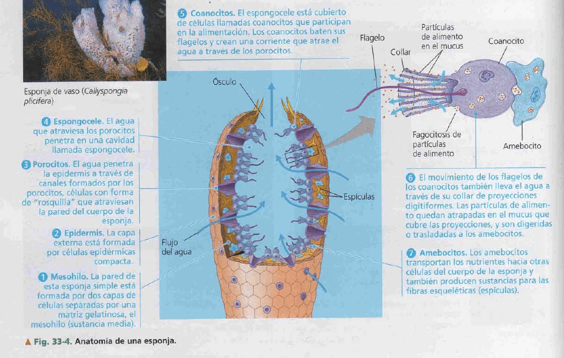
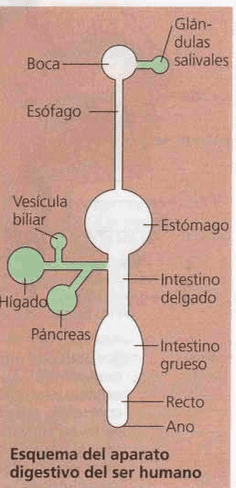
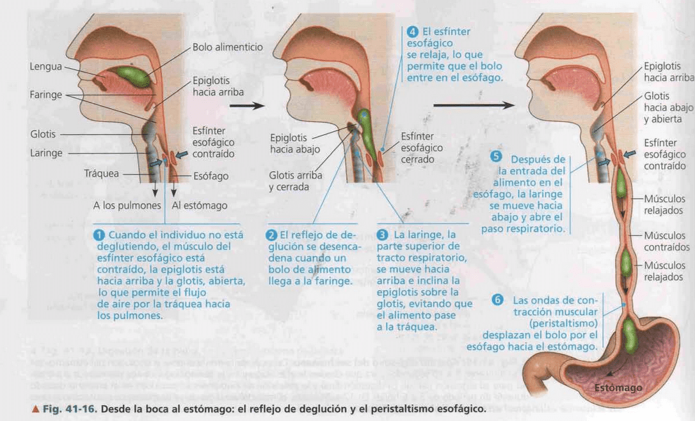
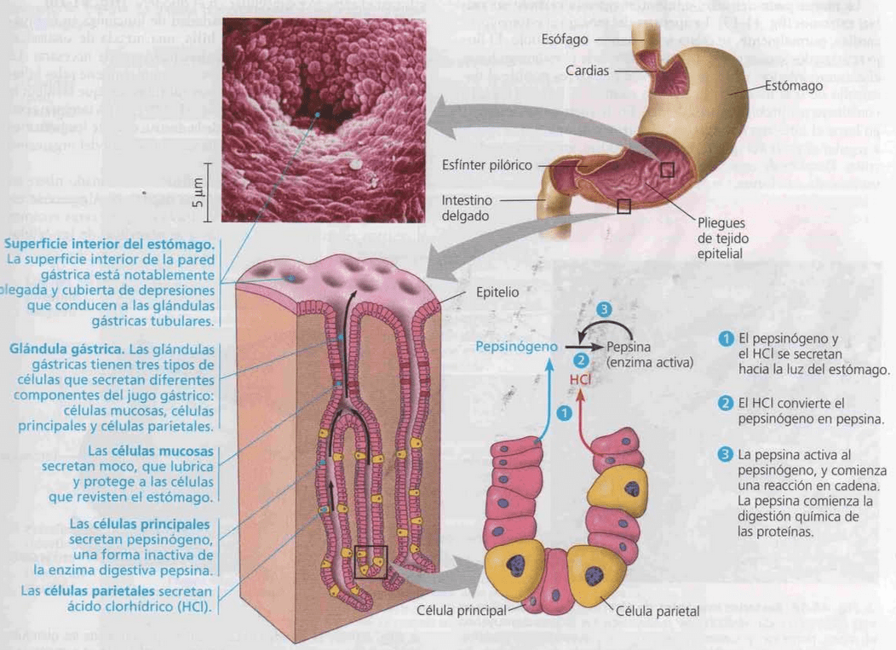
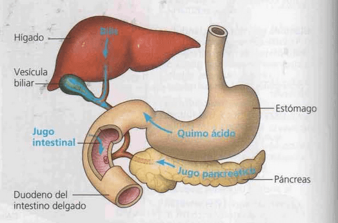
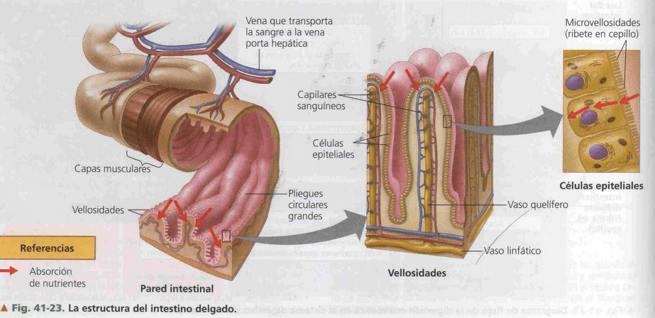

# Funciones
Las razones para la alimentación son:
- Obtener energía química (ATP)
- Obtener Materia prima para la síntesis de moléculas orgánicas (carbono)
- Obtener nutrientes esenciales. Compuestos que el organismo no puede sintetizar
# Etapas
Funciona a través de una serie de procesos:
- Ingestión: acto de comer
- Digestión: divide a las macromoléculas en sus componentes monómeros
	- Digestión mecánica: masticación en boca
	- Digestión química: hidrólisis enzimática en estomago y duodeno
		- Digestión en ácido clorhídrico: favorecen el desagregamiento de las partículas
		- Digestión enzimática: llevada a cabo por proteínas que catalizan una reacción. Se encargan de degradar polímeros en monómeros.
- Absorción: es la captación de los monómeros por las células, transportadas por torrente sanguíneo y linfático a otros órganos.
- Eliminación: pasaje del material no digerido afuera del compartimento digestivo

# Compartimentos digestivos
## Digestión intracelular
La célula engloba el alimento por fagocitosis o pinocitosis ->  vacuolas alimentarias con enzimas hidrolíticas descomponen los alimentos se fusionan con los liposomas. Las esponjas son los únicos animales con digestión **exclusivamente** intracelular.

## Digestión extracelular
Permite captar presas mas grandes, se produce en la cavidad gastrovascular en cnidarios y en el tubo digestivo en la mayoria de animales. 
# Sistema digestivo humano

## Boca
Es la primera cavidad. Las células secretoras, glándulas salivales, vierten su contenido.
Digestión mecánica y enzimática. Los hidratos de carbono se degradan a disacáridos.
Las glándulas salivales producen:
- Mucina: protege el revestimiento de la boca y lubrica el alimento para facilitar la deglución
- Buffer de Ph: ayuda a prevenir caries por neutralizar el acido de la boca
- Amilasa salival: enzima que digiere hidratos de carbono (almidón y glucógeno)
## Esófago
Conecta a boca con el estomago. En el esófago, la epiglotis obstruye momentáneamente el acceso a la tráquea y causa la relajación del esfínter del esófago. Lo que impide que la comida se vaya al sistema respiratorio. El esfínter mantiene separado el estomago del esófago, lo que impide que se escapen los gases del estomago.
El movimiento **peristáltico** que realiza el musculo liso permite bajar los bolos alimenticios.

## Estomago
Segunda digestión. Digestión química (enzimática y acida). La única enzima activa en el estomago es la pepsina que se encarga de degradar proteínas. Hay una barrera presente en el contenido acido que impide la proliferación de bacterias o patógenos. 
La cavidad del estomago tiene paredes de epitelio cilíndrico simple con mucosidad que protegen a las células del cuerpo de entrar en contacto con el acido. El jugo gástrico está formado acido clorhídrico y pepsinógeno que son secretados por las mismas células que se encuentran inscriptas en la pared del estomago. 
El acido clorhídrico rompe la matriz extracelular que une a las células, destruye bacterias y la pepsina hidroliza las proteínas a peptidos.
En la luz del estomago tenemos células principales producen el pepsinógeno (proenzima inactiva), células parietales (producen acido clorhídrico) y células mucosas (producen moco que recubre al estomago y protege a la célula de los jugos gástricos).
El pH acido genera un cambio conformacional en el pepsinógeno produciendo pepsina

## Intestino delgado

### - Higado
Produce la bilis que permite emulsificar un lípido para que pueda ser degradada por las enzimas del páncreas. Pasa a la vesicula biliar se vacía en el intestino delgado y luego es recuperada.
### - Vesícula biliar
Reservorio de las secreciones hepáticas (bilis) y sales biliares
### - Páncreas
Jugo pancreatico alcalino (bicarbonato) -> quimoneutro, hidrolasas. libera tripsinogeno inactivo
### - Duodeno
Los 1eros 25 cm int delg, recibe el quimoacido: bolo alimenticio con las enzimas hidrolíticas. Epitelio con enteropeptidasas: tripsinogeno -> tripsina -> activa + proteasas
Epielio columnar simple 
Aquí se produce la principal digestión enzimática producto de los jugos pancreáticos y la absorción de nutrientes. Cuando el bolo alimenticio sale del estomago (quimo acido) se neutraliza el ácido vertiendo los jugos del páncreas que contiene bicarbonato, que vuelve el ph neutro.
Es la parte más larga del intestino. Está recubierto por ==vellosidades== formadas por pliegues de la pared del intestino en las cuales ingresan vasos sanguíneos y linfáticos. Las células que forman parte del epitelio tienen arrugas en sus membranas plasmáticas que forman estereocilios, microvellosidades, y eso determina que la superficie de contacto de la membrana plasmática con la luz del intestino es optima, haciendo que en una menor longitud haya una mayor área.
Las microvellosidades aumentan el área de intercambio de nutrientes. En las microvellosidades ocurre la absorción. Hay dos tipos de absorciones: celular (atraviesa a las células, #transporte-activo) y paracelular (pasa por entremedio de las células, #transporte-pasivo). 
La absorción del nutriente es recogida por el sistema [Circulatorio](Circulatorio.md) y transportada al resto del cuerpo. 
Los lipidos no son solubles en la sangre, se transportan asociadas a proteínas por los vasos linfáticos que son mas permeables. 

En el intestino los disacáridos se degradan a monosacáridos, los péptidos pequeños son degradados a péptidos más pequeños y luego aminoácidos, los ácidos nucleicos son degradados hasta nucleótidos y estos son degradados a hidratos de carbono y bases
nitrogenadas y los lípidos son degradados en gotas de grasa (emulsión con las sales biliares),  luego en glicerol y ácidos grasos para poder ser absorbidos

## Intestino grueso (colon)
- **Absorción de agua** :
	Gradiente osmotico: (difusion simple) generado por la absorcion de Na+ por las bombas Na+/K+ del epitelio intestinal
	Aquaporinas: proteinas de canal (dif facilitada)
	
  explica la diarrea (no absorbe agua), o el transito que genera mucha absorción secando la materia fecal.
- **Síntesis vitaminas**: posee flora (bacterias como la E. coli) que permiten que el sistema digestivo funcione correctamente aportando vitaminas (vitamina K que permite la coagulación de sangre). 
- Las heces están formadas por material no digerido, celulosa, E. coli.
## Recto y ano
Expulsión de desechos, eliminación de lo no digerido

## Tabla digestion de biomoleculas 

|                                                       | Hidratos carbono                                                                 | Proteinas                                                                                                                                   | Acidos nucleicos                                                          | Grasas                                                                                                                                                            |
| ----------------------------------------------------- | -------------------------------------------------------------------------------- | ------------------------------------------------------------------------------------------------------------------------------------------- | ------------------------------------------------------------------------- | ----------------------------------------------------------------------------------------------------------------------------------------------------------------- |
| Cavldad oral, faringe, esofago                  | Amilasas: polisacaridos (PS) grandes -> PS pequeños |                                                                                                                                             |                                                                           |                                                                                                                                                                   |
| Estomago                                              |                                                                                  | Pepsina: Proteinas -> polipp                                                                                   |                                                                           |                                                                                                                                                                   |
| Luz del intestino delgado                             | Amilasa pancreatica: PS ->maltosa, disacaridos (DS) | Tripsinogeno (páncreas) ->Tripsina: polipp -> oligopp Carboxipep: polipp -> aa | Nucleasa pancreatica: dna, rna -> nucletidos | Bilis y Sales biliares: glóbulos grasos -> gotas Lipasa pancreatica: gotas-> glicerol, ac grasos  |
| Epitelio del intestino delgado (ribete en cepillo) | Disacaridasas: DS -> MS                             | Dipeptidasa: oligpp -> aa                                                                                      | Nucleotidasas, nucleosidasas, fosfatasas     |                                                                                                                                                                   |
