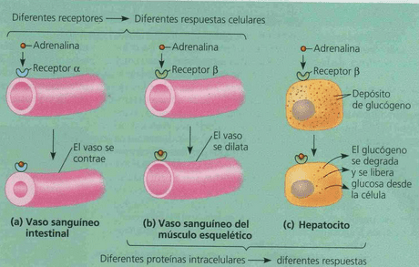
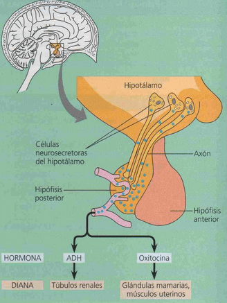

# Clasificación
Secreción de hormona desde una glándula -> torrente sanguineo -> tejido diana con receptor

## Via neuronal (neurohormonal)
- Receptor: neurona sensitiva (aferencia)
- Centro de control: hipotálamo -> neuro-hipofisis (con neurosecretoras)
- Señal eferente: neuro-hormona
- Ej: Oxitocina, ADH
## Vía endocrina
- Receptor: proteína
- Centro de control: célula de glándula endocrina
- Señal eferente: Hormona 
Ej: los receptores del páncreas sin glucosa -> libera glucagón -> en higado glucogeno a glucosa
> pancreas cumple funcion endocrina (hormonas a vaso sang) y exocrina (enzimas a cavidades internas)

## Via neuro-endocrina
Hipotálamo -> Adeno-hipófisis,  neuro + endocrina

# Hormonas
## Clasificacion quimica
### Proteicas
receptor en membrana. ej: insulina, glucagon, prolactina
transduccion en cascada de señales
### Lipidica
receptor en nucleo. ej: testost, estrogeno
## Respuestas

La adrenalina, produce vasoconstriccon en el intestino porque tiene receptores α, y dilatacion en musculo por receptores β
En deposito glucogeno con receptores β el efecto es diferente al vaso del musculo con el mismo receptor

## Hipófisis posterior o Neurohipófisis

==Vía neuronal== la hipofisis posterior es una extension del hipotalamo (tejido nervioso). Ciertas celulas neurosecretoras hipotalamicas sintetizan la hormona antidiuretica (ADH) y la oxitocina, que se transportan hasta la hipofisis posterior donde se almacenan. Las senales nerviosas del cerebro desencadenan la liberacion de estas neurohormonas.

## Hipófisis anterior o adenohipófisis

Es una glandula (tejido epiteliar especializado) la liberacion de hormonas sintetizadas en la hipófisis anterior se controla por las hormonas troficas del hipotalamo. 
Sigue ==via neuro-endocrina== : Las hormonas del hipotálamo son estimulantes o inhibitorias de otras hormonas y se secretan por celulas neurosecretoras a una red de capilares que recorre el hipotalamo. Estos capilares drenan a vasos porta que conectan con una segunda red de  capilares de la hipofisis anterior. Cada hormona sintetizada en la hipofisis anterior se secreta en respuesta a una hormona liberadora especifica.
### Efectos tróficos
Relacionados con el crecimiento, desarrollo y mantenimiento de otros tejidos o glándulas.
### Efectos no tróficos
Otras funciones como metabolismo, respuestas a estrés, sistema inmune. 
### Retroalimentacion negativa

El hipotalamo secreta la hormona liberadora de TSH (TRH), que estimula a la hipófisis anterior para secretar tirotropina (TSH). La TSH estimula, entonces, a la tiroides para sintetizar y liberar las hormonas tiroideas T 3 y T 4 . Estas hormonas ejercen una  retroalimentacion negativa sobre el hipotalamo y la hipofisis anterior, al inhibir la liberation de TRH y TSH.

### Homeostasis calcio

Un sistema de retroalimentacibn negativa que implica a dos hormonas antagonicas, calcitonina y hormona pa¬ ratiroidea (PTH), mantiene la concentracion de Ca 2+ en sangre cerca de la concentracion estable.