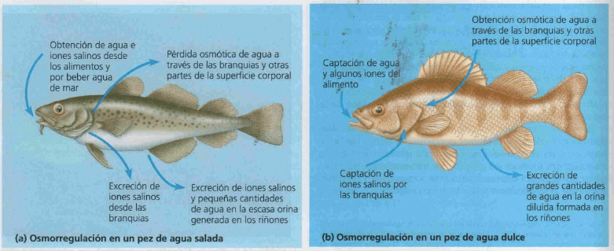
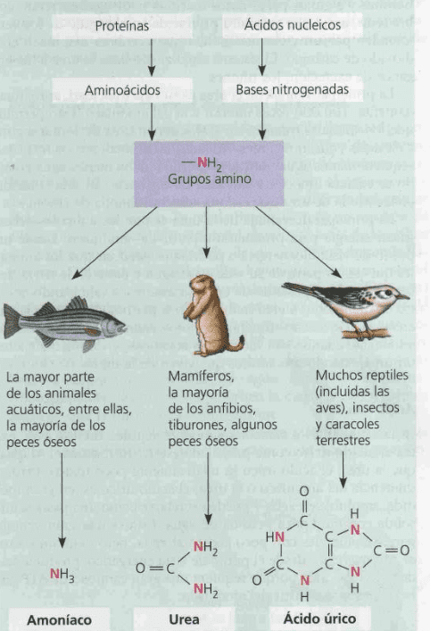
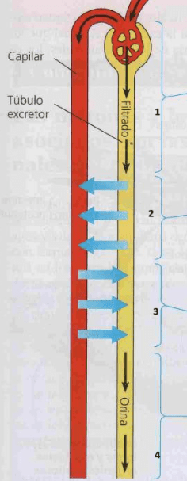
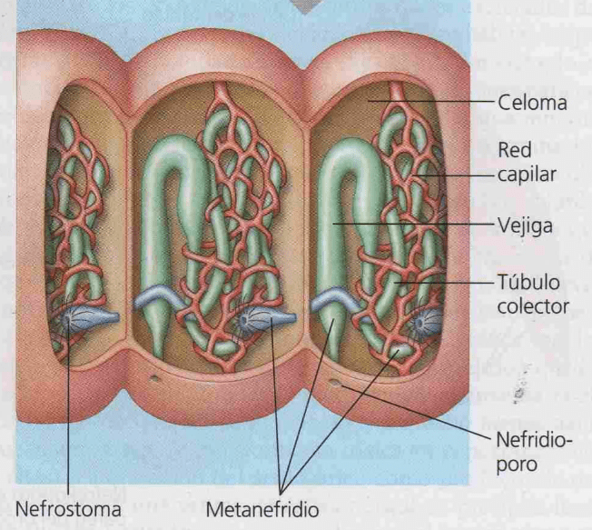
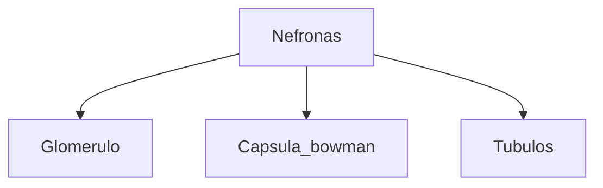
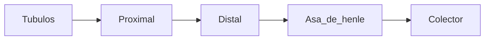
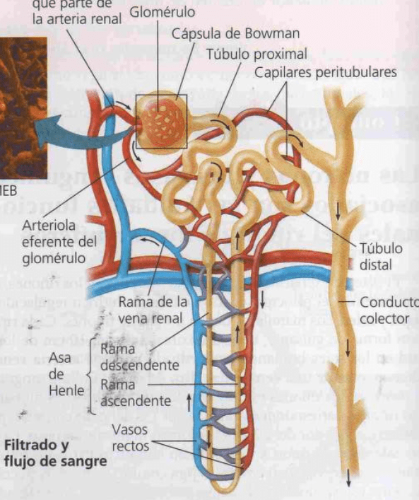
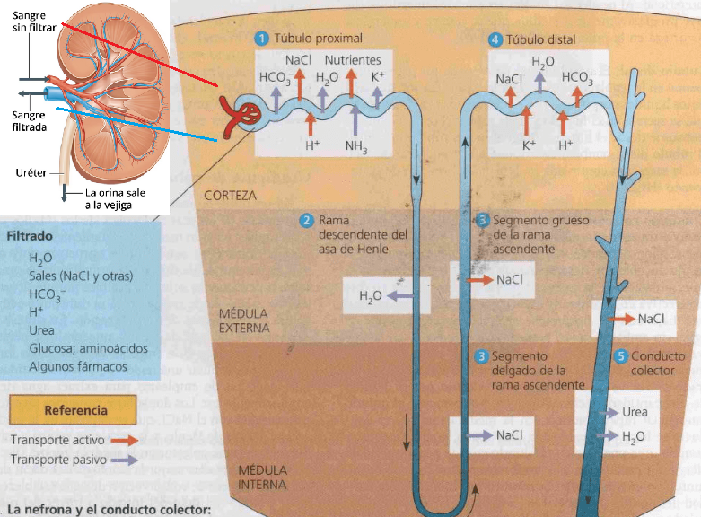
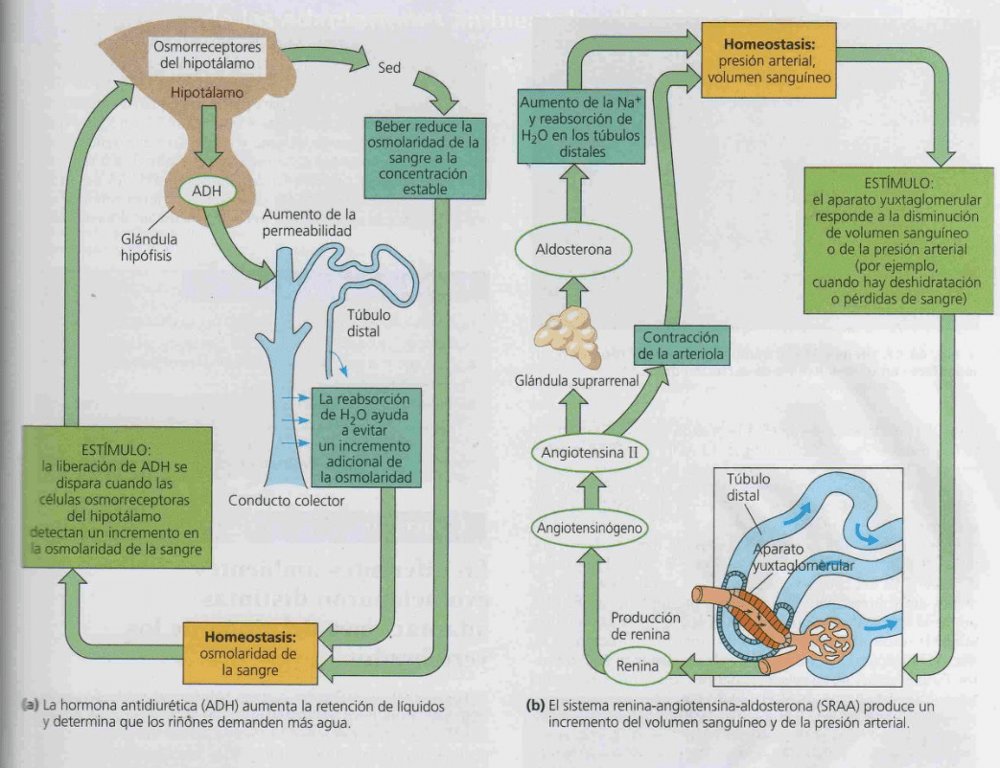

# Clasificación estrategias
La regulación para llevar liquido intersticial a ser isotónico con la célula
## Regulación 
- Conformistas: se mantiene isosmótico con el ambiente sin ajuste activo de osmolaridad. Ej: lamprea
- Osmoregulador: implica un coste energético para ganar o perder agua y sales según el caso.

## Rango 
- Estenohalinos: rango estrecho de osmolaridad, mayoría de animales, hay tanto conformistas como reguladores 
- Eurihalinos: toleran cambios amplios de concentración osmótica externa. Ej: salmón (osmoregulador), mejillón (conformista)

# Desechos nitrogenados
## Amoníaco
Muy soluble y permeable a través de las membranas, muy toxico se elimina diluido en grandes cantidades de agua.
Usado por **peces óseos, crustáceos, moluscos y larvas de anfibios** se elimina como NH4+ intercambiando por Na+
## Urea
Baja toxicidad y requiere menos agua (se excreta mas concentrado). En mamíferos producida en el hígado, union de NH3 con CO2, requiere gasto de energía. 
Usado: **peces cartilaginosos, anfibios, mamíferos.**
## Acido úrico
Insoluble se excreta semisolido , mas costoso energéticamente.
Ventajas: ahorro de agua, muy baja toxicidad para embrión de huevos con cascaras (permeables a gases pero no líquidos). 
Usado **insectos, reptiles y aves**

# Sistemas excretores
## Procesos

### 1 Filtración pasiva
Recolección de sangre, hemolinfa y liq celómico -> monocapa de epitelio de transporte. Retención en el cuerpo de moléculas grandes y celulas, pasa liquido con solutos pequeños (desecho N, biomoleculas) al tubo excretor. 
Infeccion: puede afectar a la filtracion del epitelio -> pasaje de hematies a la orina (hematuria)
### 2 Reabsorción selectiva
El epitelio de transporte reabsorbe sustancias valiosas del filtrado y las devuelve a los liquidos corporales.
Infeccion: perdida de selectividad pasando proinas de orina a la sangre (protein-urea)
### 3 Secreción
Otras sustancias, como las toxinas y el exceso de iones, son extraidas desde los liquidos corporales y anadidas al contenido del tubulo excretor.
### 4 Excreción
El filtrado abandona el sistema y el organismo.

## Sistemas
### Protonefridios
En ptatelmintos (gusanos planos de agua dulce), red de tubulos con celula flamigera los extremos ciegos (sin aberturas internas).
Filtracion: movimiento del liquido impulsado por los cilios de la celula flamigera.
Excrecion: por la abertura final del tubo hacia afuera, funcion osmorreguladora. Tambien excretan por la cavidad gastrovascular hacia la boca.

### Metanefridios
En moluscos y anélidos.
Nefrostoma: embudo ciliado que conecta los segmentos. El liquido pasa a través de un tubo colector en espiral, se produce reabsorción por el epitelio de transporte, y llega a la vejiga de almacenamiento que se abre al exterior a través del nefridioporo. 
Función: excreción osmorregulación

### Túbulos de Malpighi
Túbulos con extremos internos ciegos, el epitelio de transporte secreta solutos y desechos de la hemolinfa al interior del tubulo. El agua ingresa por osmosis, en el recto se produce la reabsorción de solutos y agua. Se excreta acido úrico solido. Muy eficientes en la conservación del agua. 

### Riñones 
Vertebrados
#### Nefronas
Unidad funcional, partes:
- Glomérulo: ovillo de capilares
	La presión produce el movimiento (filtrado pasivo) de H2O, sales, urea.
- Capsula de Bowman: zona ensanchada que rodea al glomérulo.
	Compuesta por epitelio de transporte con **podocitos**, células especializadas en la filtración.
- Túbulo: proximal ⮕ asa de henle ⮕ distal ⮕ colector
	- Reabsorcion: sales, nutrientes (actva). H2O (pasiva)
	- Secrecion:  H+(act), NH3 (pas)

El epitelio en la rama descendente es solo permeable al agua, el liq intersticial es hipertonico
En la rama ascendente es permeable al NaCl, y la orina llega con alta osmolaridad, el medio es hipotonico y sale NaCl (pasivo en medula interna y luego activo)
Llega al tubulo colector diluida con alta osmolaridad en la medula por el paso anterior generando la reabsorcion de agua y urea
#### Control hormonal

b ) la contraccion de la arteriola para equilibrar la presion sanguinea hace que llegue menos liquido al glomerulo. Menor filtracion y excresion. 