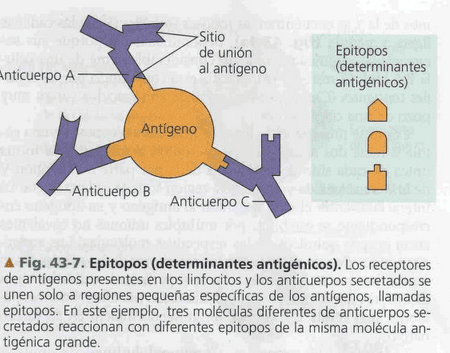
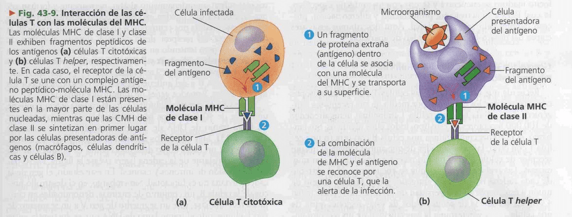
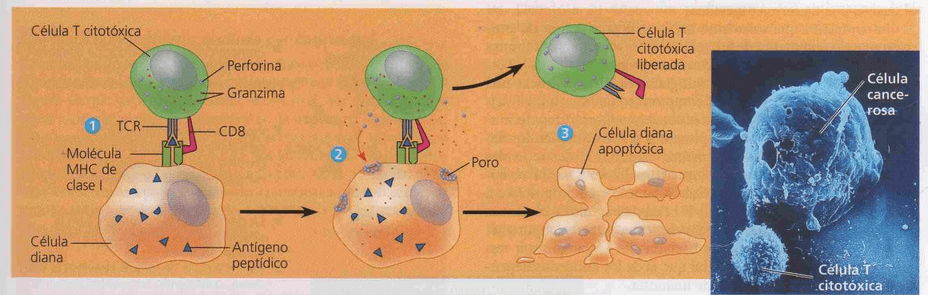
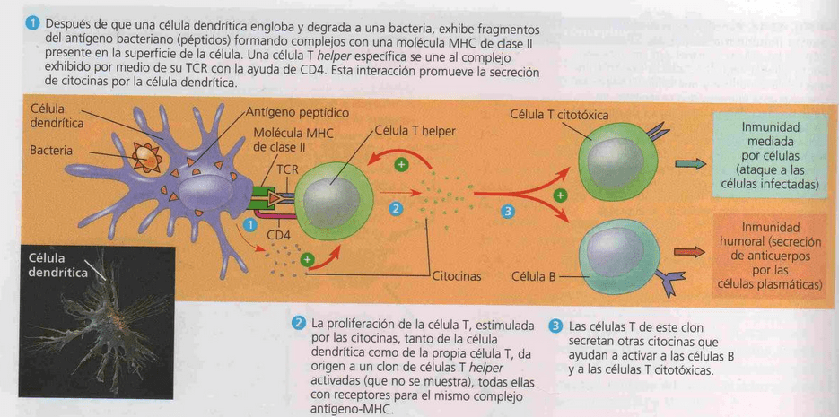
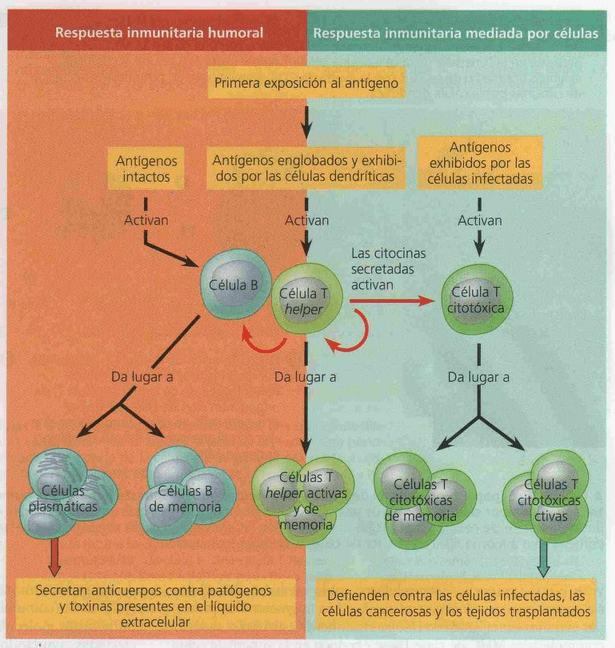
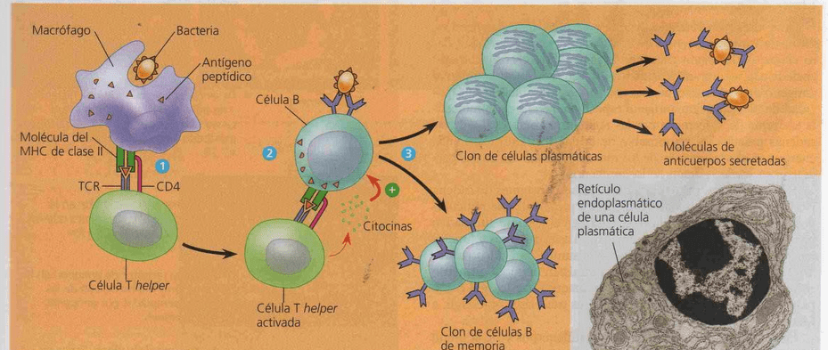
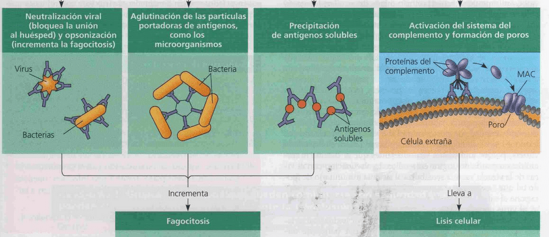

# Clasificacion gral
## Funciones:
Recuperación líquido instersticial y devolución al SC
Respuesta inmunitaria: macrofagos en ganglios linfáticos, maduración linfocitos en bazo y timo.

- Inmunidad innata:  inespecíficas, reconocen y responden con rapidez a un gran espectro de microorganismos. Agentes: Piel, mucosas, defensas celulares como macrófagos
- Inmunidad adquirida (adaptativa): exposición a agentes inductores, respuesta especifica. Agentes: linfocitos (gl blancos)

# Inmunidad innata
## Defensas externas
- Piel: barrera física (epitelio escamoso estratificado)
- Secreciones: lavado y expulsión. ej lagrimas saliva. 
- Membranas mucosas: modificación del pH: ej glándulas sebáceas y sudoríparas -> pH 3-5. Estomago pH 2-3.  Producción de enzimas hidrolíticas para bacterias como lisozima en saliva y mocos

## Defensas internas
Fagocitos: glóbulos blancos.  se adhieren a su presa por medio de receptores de superficie. Los engloba en una vacuola que se fusiona con un lisosoma (degradación x lisozima y oxidantes).
### [Leucocitos](Circulatorio.md#Sangre) fagocíticos
- Neutrófilos: la mayoría, se autodestruyen en la fagocitosis
- Macrófagos: a partir de los monocitos, alta capacidad de fagocitar. Móviles y con ubicación permanente en los ganglios linfáticos.
- Eosinofilos: poca actividad fagocítica, descargan enzimas destructivas. Protegen contra [parásitos multicelulares](1_Diblasticos-Acelomados.md) como Schistosoma ^372d94
- Celulas dendríticas: estimular el desarrollo de la inmunidad adquirida, fagocitosis.

### Proteínas antimicrobianas
Sistema del complemento, sin infeccion estan inactivas. sustancias de la superficie de microorganismos -> cascada de activacion
Interferón α y β: detienen la replicacion viral
Interferón γ: aumenta actividad macrófagos 

### Respuesta inflamatoria
**Resp local:** generada por daño al tejido por la lesión física o la entrada de patogenos, liberacion de histamina almacenada en mastocitos, ⇑ dilatacion y permeabilidad de capilares => favorece llegada de prot. antimicrobianas, anticoagulantes y macrofagos (⇑ glob blancos) => enrojecimiento típico. 

**Respuesta sistemática**: fiebre, inducida por toxinas liberadas por macrófagos. Favorece la fagocitosis y reparación de tejidos.

### Células NK (natural killer)
Patrullan y atacan a las células que están infectadas por virus, como también a las células cancerosas. Estas infecciones producen inhibición del complejo MHC (de protección), cuando las NK detectan ausencia del MHC introducen sustancias que generan ==apoptosis== en células infectadas. 
El MHC I es inhibidor de las NK

# Inmunidad adquirida
Se retroalimenta con la innata. Ej fagocitos -> liberan citoquinas -> activan [linfocitos](Circulatorio.md#Diferenciación%20celular) 
**Antígeno**: sustancia extraña reconocida por los linfocitos, ej:  proteinas, polisacaridos. El **epítopo** es la parte reconocible
**Anticuerpos**: secretados por ciertos linfocitos en respuesta a los antígenos, cada linfocito tiene especificidad contra un antigeno, sus receptores de antigeno son todos iguales para un determinado epitopo.

## Linfocitos B
**Formación**: celulas madre (medula), **maduración** en la medula (B = bone marrow)
Receptor en forma de Y con 2 cadenas polipeptididcas pesadas y dos livianas. Reconoce un ==antígeno intacto== en su estado nativo. Generan los anticuerpos (**respuesta humoral**)
## Linfocitos T
**Formación**: celulas madre (medula), **maduracion** en el timo
Cadena α y β , unidas por un puente disulfuro. Los TCR receptores de las células, T ==reconocen fragmentos== de antígenos unidos a proteínas de superficie de las células normales (dianas para las T) llamadas moléculas del MHC (complejo mayor de histocompatibilidad) que llevan un fragmento de antigeno

### T citotóxico 
Reconoce los epítopos expuestos por el **MHC clase I** presente en las ==células generales==.
Cuando este linfocito reconoce a la célula con el problema, genera la apoptosis (destrucción de la célula) liberando perforinas que producen poros y granzimas proteoliticas generando ==apoptosis==.

1) Una celula T citotóxica especifica se une a un complejo antigeno - MHC de la celula diana por medio de su TCR con la ayuda de CD8. Esta interacción, junto con las citoquinas de las celulas T helper, ayuda a la activación de las células citotóxicas.
2) La célula T activada libera moléculas de perforina, que forman poros en la membrana de la célula diana y enzimas proteolíticas (granzimas), que entran en la célula diana por endocitosis.
3) Las granzimas inician la apoptosis dentro de las células diana provocando la fragmentación del nucleo, la liberacion de pequenos cuerpos apoptosicos, y por ultimo, la muerte celular. La celula T citotóxica liberada puede atacar a otras celulas diana.
### T helper
Reconoce los epítopos expuestos por el **MHC clase II**
Interactúa con las ==celulas presentadoras de antígenos== (fagociticas: macrófagos, dendríticas, cel B) un linfocito T helper reconoce a la proteína expuesta y este le avisa al resto de los linfocitos cómo era el patógeno para que lo destruyan y para que se fabriquen los anticuerpos necesarios.

El pape fundamental de las células T helper en la respuesta inmunitaria humoral y la respuesta inmunitaria mediada por células.  Las células dendritas son las principales células presentadoras de antígeno durante la respuesta primaria. 
TCR = receptor de célula T. ⊕ indica estimulación.
## Desarrollo de los linfocitos
Originados en cels pluripotenciales de la médula osea
- Celulas B (bone) maduran en la medula osea.
- Celulas T maduran en la glándula del timo.
Division activa de linfocito B con el anticuerpo especifico

## Respuesta humoral
Implica el desarrollo de anticuerpos
La estimulación de las células T-helper por un antígeno, por lo general, requiere contacto directo entre una celula dendrítica y una célula T helper en una respuesta primaria o entre un macrofago y una celula T de memoria en una respuesta secundaria (no se muestra). Una vez activada, la celula T helper estimula la respuesta humoral en forma directa, al contactar con las celulas B y en forma indirecta al secretar citoquinas. Una celula T helper activada estimula la respuesta mediada por células de forma indirecta por medio de las citoquinas.

### Ciclo
1) Después que un macrófago engloba y degrada a una bacteria, exhibe el antígeno peptídico asociado al MHC II. Una celula T helper que reconoce el complejo exhibido se activa con ayuda de citoquinas secretadas por el macrofago, formando un clon de celulas T helper activadas (no se muestran).
2) Una celula B que ha incorporado y degradado a la misma bacteria exhibe complejos antígeno peptido-MHC de clase II. Una celula T helper activada que lleva receptores específicos para el antígeno exhibido se une a la celula B. Esta interacción, con ayuda de las citoquinas provenientes de la célula T, activa a la célula B.
3) La célula B activada prolifera y se diferencia en células B de memoria y células plasmáticas secretoras de anticuerpos. Los anticuerpos secretados (inmunoglobulinas: Ig) son específicos para el mismo antígeno bacteriano que inició la respuesta.
4) La unión de las Ig a los patógenos inhiben su funcionalidad

### Tipos de anticuerpos
Las inmunoglobulinas son proteinas con estructura en forma de Y similares al receptor de una celula B, pero carece de la región transmembrana .
- IgM: Pentámero. Es la primera que se libera ante la exposicion al antigeno. Mecanismos de acción (por importancia): 4, 1, 2
- IgG: Monómero. Es la más abundante. La unica que atraviesa la placenta.  MA: 1, 2
- IgA: Dímero. Presente en las secreciones (lagrimas, saliva, leche materna). MA: 1, 2
- IgE. Monómero. Liberacion de histamina, reaccion alergica
- IgD: Monómero. Originalmente está expuesto en el linfocito B desactivado. Tiene una región transmembrana. Cuando es activado por el T helper comienza a producir los tipos anteriores de inmunoglobulina.
Todos los tipos de inmunoglobulina son para lo mismo. Se liberan en respuesta al mismo patógeno.
#### Mecanismos de acción
1. Neutra, opso
2. Aglu
3. Preci
4. SC

Los primeros aumentan la efectividad de la fagocitosis, y con las proteínas de complemento se ataca a la célula patógena.
# Inmunidad en invertebrados
Fagocitosis por células ameboides en [equinodermos](4_SF-Deuteróstomos)
Barrera fisica externa del exoesqueleto de [insectos](3_SF-Ecdisozoa)
Hemolinfa: hemocitos-> fagocitosis, peptidos antimicrobianos 

# Filtracion
La hemolinfa es filtrada por el sistema [Excretor](Excretor.md)