# Composición
## Organización de los SN
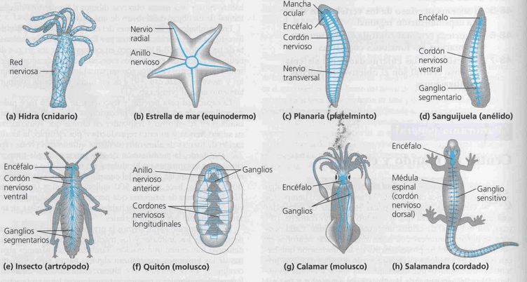
## Procesamiento de la información
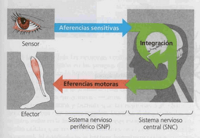
Aferencia y eferencia sensitiva: nervios del SNP
Integracion: analisis del SNC

## La neurona

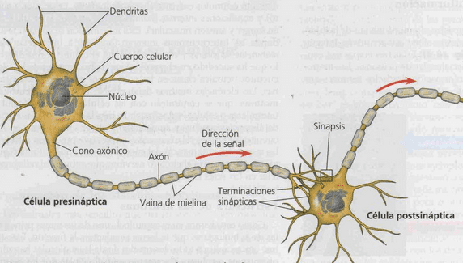
sinapsis: interacción entre 2 neuronas
union neuro-muscular o placa motora: neurona-musculo

- Dendritas: prolongaciones membrana plasmatica en el cuerpo celular
- Terminaciones sinapticas (telodendras)
- Celulas de shwann
	- envuelven a los axones formando vainas de **mielina** (membrana celular alta ctc lípidos -> aislante electrico)
	- regeneracion axones dañados
	- fagocitosis desechos celulares

## Potencial de membrana
Es el potencial de membrana cuando no esta transmitiendo señales, concentraciones ionicas internas y externas
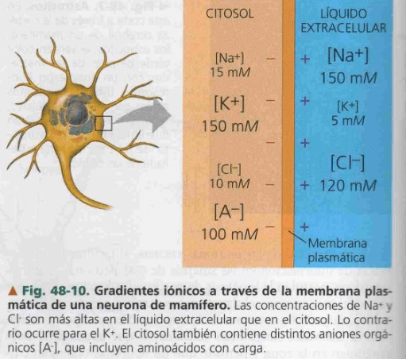

**potencial de reposo:** 
sin estimulos: interior de la neurona: baja [Na+] alta [K+]
liquido extracelular inverso
Bomba de Na en la membrana plasmática: saca 3 Na, ingresa 2 K -> se produce un desbalance quedando mas negativo interior. 
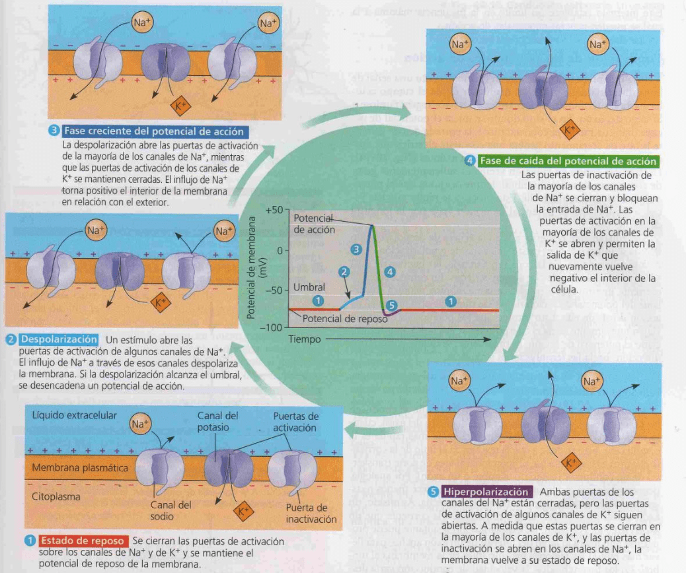
1. estado de reposo: canales cerrados, solo actua la bomba Na-K
2. despolarizacion: aferencia sensitiva (estimulo) apertura de canales -> movimiento a favor del gradiente -> se despolariza la membrana, ingresa Na+ y se hace mas positiva
3. el potencial llega a -50 y se produce el ==potencial de acción creciente==, apertura rapida de todos los canales de Na, 
4. caida potencial accion: se abren los canales de K para salir, y se cierran los de Na para que no sigan saliendo

#### Conducción del potencial
la despolarizacion se va transmitiendo a traves de la membrana del axon hasta llegar a la sinapsis
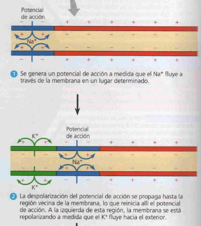

las vainas de mielina generan los nodos de ranvier que son zonas ya despolarizadas (potencial de membrana +) permitiendo que el impuslo nervioso viaje mas rápido (saltacional)
impacto salud: parkinson degradacion mielina
## Sinapsis
Hay uniones comunicantes (gap) entre las membranas de las neuronas, que permite que se transmita el potencial. entre neuronas, puede ser bidireccional. Comun en invertebrados,ej: respuestas rapida de huida en crustaceos, corazon en vertebrados
### Quimica
comunicacion con neurotransmisores, direccion unidereccional (pre a pos sinaptica)
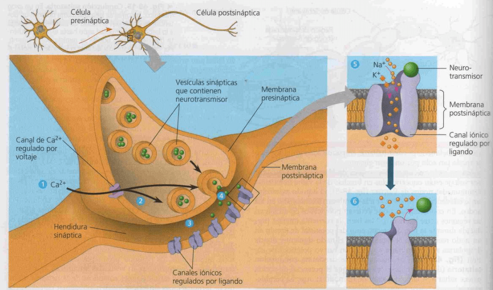
1. Cuando un potencial de acción despolariza la membrana plasmática de la terminación sináptica,
2. abre los canales de Ca2+ regulados por voltaje en la membrana y desencadena la entrada de Ca 2+
3. La concentracion elevada de Ca 2+-> promueve exocitosis:  vesiculas sinapticas se fusionen con la membrana presináptica.
4. Las vesículas liberan el neurotransmisor en la hendidura sináptica. 
5. El neurotransmisor se une a la porción del receptor de los canales iónicos regulados por ligando en la membrana postsinaptica y abre los canales. Se puede difundir tanto Na + como K+ a través de los canales. El ingreso de estos cationes genera la despolarizacion de la membrana en la celula postsinaptica y se repite el ciclo. 
6. El neurotransmisor se libera de los receptores y los canales se cierran. La transmision sinaptica termina cuando el neurotransmisor se difunde fuera de la hendidura sináptica, es captado por la terminacibn sinaptica u otra celula o es degradado por una enzima. 

#### Receptor en canal K+
su apertura liberando K de la neurona postsinaptica generara la hiperpolarización (mas negativa) -> estimulo **==inhibitorio==** (ver 48.10) -> despues cuesta mas generar el potencial de acción.
Ej: serotonina
### Receptor en canal Na+
ingresa el Na generando potencial de accion y transmicion de la señal -> estimulo ==excitatorio==

#### Neurotransmisores

# Especialización en vertebrados
 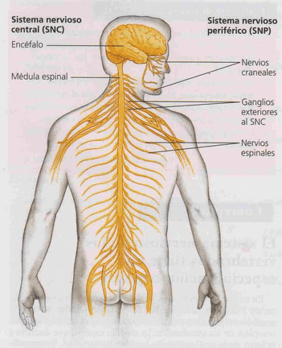
- Nervios: paquetes de axones
- Ganglios: agrupación de cuerpos neuronales 
## Clasificación

El SNC respuesta conciente
SNP respuestas involuntarias, automáticas 
Autonomo: estimulos internos. ej: enterica: moviminentos peristalticos
somatico: estimulos sensoriales que generan una respueta motora. ej: tiritar

### SNC
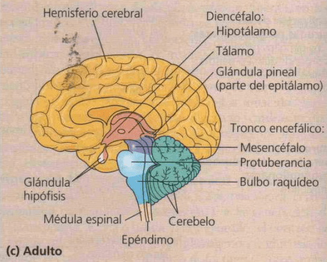
diferentes organos
### SNP
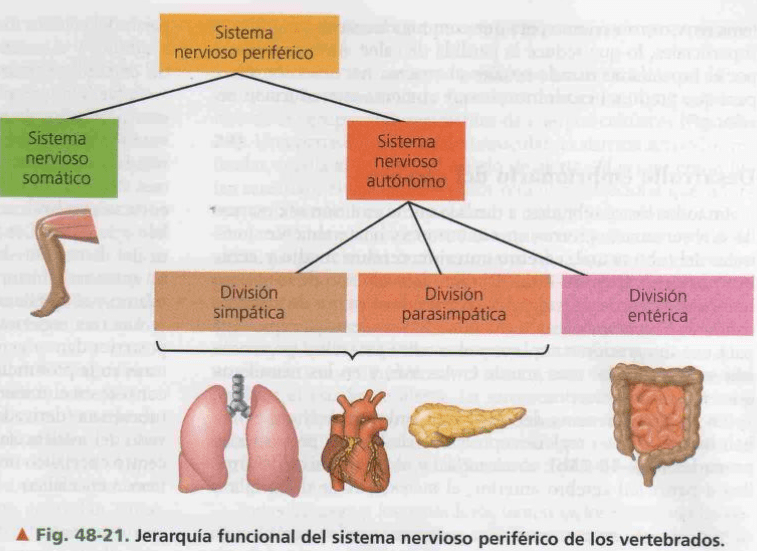

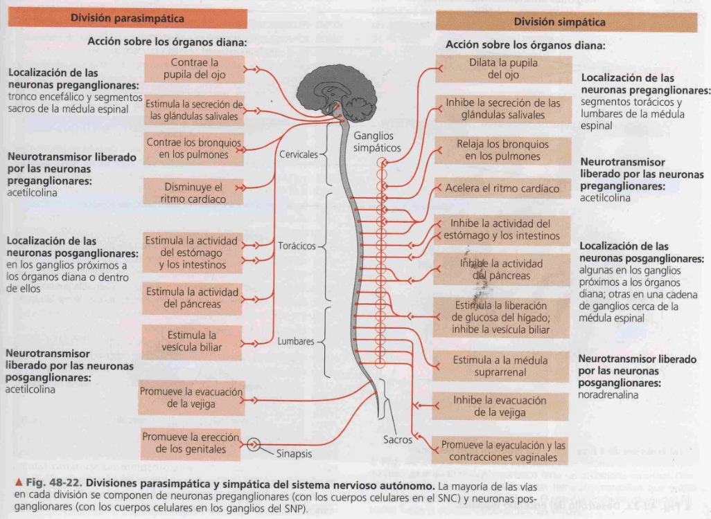
efectos antagonicos que mantienen la homeostasis
#### Simpático
Preparación del cuerpo para enfrentar situaciones de estrés, peligro o actividad intensa (fight or flight)
#### Parasimpático
Relajacion, actividades normales

arco reflejo: evaluacion de relacion entre el snp y el snc
aferencia sensitiva (snp) - snc - eferencia motora (snp)

