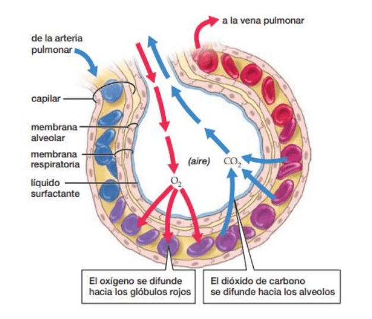

## SISTEMA RESPIRATORIO
Es un conjunto de órganos y tejidos, que permite el intercambio de gases.
Las células requieren incorporar oxígeno y deshacerse del dióxido de carbono
Lo más importante es deshacerse del CO2
Está asociada con el sistema circulatorio
El intercambio de gases ocurre entre el organismo y el medio en el que se encuentra
La **superficie respiratoria** es altamente vascularizada o está expuesta a la sangre.
==**Órganos respiratorios**==
- Membrana plasmática ->  Organismos unicelulares
- Piel (cutánea)-> Algunos parásitos, Planarias
- Branquias -> Peces
- Tráqueas -> Insectos
- Pulmones -> Cordados

### Branquias
Tejido altamente vascularizado. Suelen estar protegidas por ciertas estructuras debido a su debilidad. Las branquias tratan de extraer el O2 del agua, lo que hace necesario una modificación que permita saturar la hemoglobina con el O2 presente en el agua.
El oxigeno sigue un gradiente de concentración.
El agua va a contracorriente con la sangre, esto hace que esté expuesta siempre a agua con una concentración mayor de oxigeno, lo que hace que éste tienda a ir hacia la sangre.

Flujo a contracorriente, Ingreso de H2O con O2.

### Traqueas
El aire se renueva gracias a unos sacos aéreos rodeados de músculo que se contraen y
expanden permitiendo el bombeo de aire
El intercambio de gas de produce por las tráqueas directamente con el tejido circundante.

El mov del saco aereo premite que ingrese el aire por las traqueas y llega hasta las celulas directamente, no hace falta vasos del sistema circulatorio (tiene SC abierto)
### Pulmones
Son una serie de sacos muy pequeños que poseen una entrada llamados alveolos que están altamente vascularizados.
En la inhalación el diafragma se contrae y en la exhalación, se expande.

La entrada de aire es por presion negativa por contraccion del diafragma

==**Funcionamiento del sistema respiratorio**==
El sistema respiratorio en los seres humanos y otros vertebrados que respiran con pulmones puede dividirse en dos partes: la **parte conductora** y la parte de **intercambio de gases**.
La *parte conductora* transporta el aire hacia los pulmones y contiene el aparato que hace posible el habla.
El aire entra a través de la nariz o boca, pasa a la faringe y luego a la laringe (regulada por la epiglotis para separar del sistema digestivo). El aire inhalado va hacia la tráquea, que luego se divide en dos grandes ramificaciones llamadas bronquios, cada uno de los cuales desemboca en un pulmón. Dentro del pulmón los bronquios se ramifican hasta dividirse en bronquiolos.
Los bronquiolos llegan a los alveolos, que son sacos diminutos donde ocurre el **intercambio de gases**. Una red capilar cubre la mayor parte de la superficie alveolar.

==Circulación del aire==
La respiración ocurre en dos etapas: (1) inhalación, cuando el aire entra en los pulmones y (2)
exhalación, cuando sale de los pulmones. La inhalación ocurre cuando la cavidad torácica se
agranda. El límite inferior de la cavidad torácica está formado por una lámina muscular: el
diafragma, que tiene forma de domo hacia arriba cuando está relajado. Durante la inhalación,
el diafragma se contrae, jalándolo hacia abajo. Los músculos de las costillas también se
contraen durante la inhalación, levantando las costillas hacia arriba y hacia fuera.

