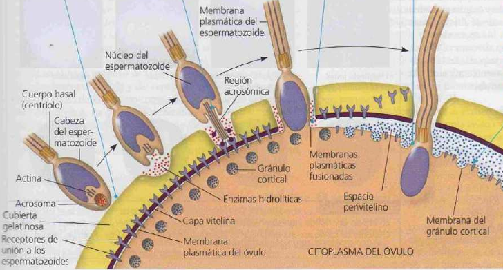

# Tipos
## Asexual
solo mitosis -> sin gametos, gral 1 organis, sin variabilidad : clones
- fragmentacion: regeneracion mitotica, ej estrella
- gemación: individuo miniatura mitótico. ej levaduras, hidras
- fision: particion mitad organismo multicelular 
## Sexual
- hermafroditismo: ambos organos sexuales. (mono y biparental)
	- simultaneo: lombrices, caracoles
	- secuencial
		- temporal: organos sexuales funcionales en distitintos momentos. ej pez payaso (proteroginia, protandria)
		- espacial: pila de caracoles marinos (moluscos), sexo segun ubucacion en la pila
meiosis -> gametos, 1 (hermafroditas) o 2 (dioicos), recombinación y variabilidad

Dioicos: biparental
### Tipos de fecundacion
- Externa: union de los gametos afuera del cuerpo
- Interna: union adentro del cuerpo fem
#### Aparato masculino
espematogenesis: 35° -> testiculos afuera del cuerpo con movimiento segun la temperatura
Glandulas: uretra: vesicula seminal (60% de liquidos), glandula copper -> lubricantes (acto sexual)
Testiculos: formado x tubos seminíferos.  células x meiosis -> espermatozoides. celulas de leydig -> testosterona
vesicula seminal: aporta fructuosa para generar atp (movimiento)
semen: nutre rodea y protege a los espermatozoides
prostata: aporte alcalino para neutralizar medio acido en vagina, prostaglandinas limpia el moco del cervix
#### Aparato femenino
glandulas de bartholin: lubricacion
ovarios: ovocitos -> foliculos -> ovulos
utero: recubierto por endometrio capa epitelial muy vascularizada para la implantacion del cigoto
cervix: con tapon de moco de proteccion. 
--> coagulación -> movimientos útero para ingresar el coagulo

### Cromosomas
Homologos: son dos cromosomas con los mismos genes (con diferentes alelos), aportado por cada uno de los progenitores. 

Aquí se muestra una célula con un número diploide de 6 (2n = 6) en G, de la interfase, a continuación de la replicación de los cromosomas (los cromosomas se condensaron de forma artificial). Cada uno de los seis cromosomas duplicados está compuesto por dos crómatides hermanas unidas por el centrómero. Cada par homólogo está compuesto por un cromosoma del conjunto materno (rojo) y una del conjunto paterno (azul). Cada conjunto consta de tres cromosomas. Las cromátides no hermanas son cualquiera de dos cromátides en un par de cromosomas homólogos que no son cromátides hermanas.

| Propiedad                                      | Mitosis                                                                                                                             | Meiosis                                                                                                                                                      |
| ---------------------------------------------- | ----------------------------------------------------------------------------------------------------------------------------------- | ------------------------------------------------------------------------------------------------------------------------------------------------------------ |
| Replicación del DNA                            | Se produce durante la interfase antes de comenzar la mitosis                                                                        | Se produce durante la interfase antes de comenzar la meiosis I                                                                                               |
| Número de divisiones                           | Una, que incluye profase, metafase, anafase y telofase                                                                              | Dos, cada una incluye profase, metafase, anafase y telofase                                                                                                  |
| Sinapsis de los cromosomas homólogos           | No                                                                                                                                  | Se produce durante la profase \|, al formar tétradas (grupos de cuatro cromátides); se asocia con el entrecruzamiento entre las cromátides no hermanas       |
| Número de células hijas y composición genética | Dos, cada una diploide (2) y genéticamente idéntica a la célula progenitora                                                         | Cuatro, donde cada haploide (n), contiene la mitad de los cromosomas de la célula progenitora, genéticamente diferentes de ésta y de las demás células hijas |
| Función en el cuerpo del animal                | Permite originar un adulto multicelular a partir de un cigoto; produce células somátias para el crecimiento y la reparación tisular | Produce gametos; reduce el número de cromosomas a la mitad e introduce variación genética entre los gametos                                                  |
### Espermatogenesis

celulas de sertoli: aportan nutrientes para maduracion de espermatidas tempranas -> espematozoides
#### Control hormonal

La hormona liberadora de gonadotrofina (GnRH) producida por el hipotálamo estimula al lóbulo anterior de la hipófisis para que secrete dos hormonas gonadotróficas con efectos diferentes sobre los testículos, la hormona luteinizante (LH) y la hormona folículo-estimulante (FSH). La FSH actúa sobre las células de Sertoli que nutren a los espermatozoides en vías de desarrollo. La LH actúa sobre las células de Leydig para que produzcan andrógenos, sobre todo, testosterona. La retroalimentación negativa realizada por la testosterona sobre el hipotálamo y el lóbulo anterior de la hipófisis es el mecanismo fundamental de control de los niveles sanguíneos de LH, FSH y GnRH.
### Ovogénesis

ovocito primario en foliculos detencion en profase I
A partir de pubertad la FSH estimula la ovulacion el desarrollo ovocito secundario hasta metafase II
SI hay fecundacion se termina la meiosis
#### Control hormonal

pico de LH y estrogeno generan la ovulacion
el engrosamiento del endometrio para la implantacion vascularizada del embrion
en el embarazo estrogeno y progesteron se mantienen alto -> retro- inhiben la ovulacion luego del embarazo
🠉 estrogeno promueve retro+ 🠉FSH y 🠉LH

### Fecundacion

acrosoma: vesicula con enzimas -> exocitosis
mitocondrias: movimiento cola del ATP
union del espermatozoide con receptores en el ovocito 2dario -> despolarizacion membrana (bloqueo rapido polispermia)
fusión de membranas -> aumento Ca2+ -> liberación gránulos corticales -> endurecimiento capa vitelina (bloqueo definitivo polispermia)

