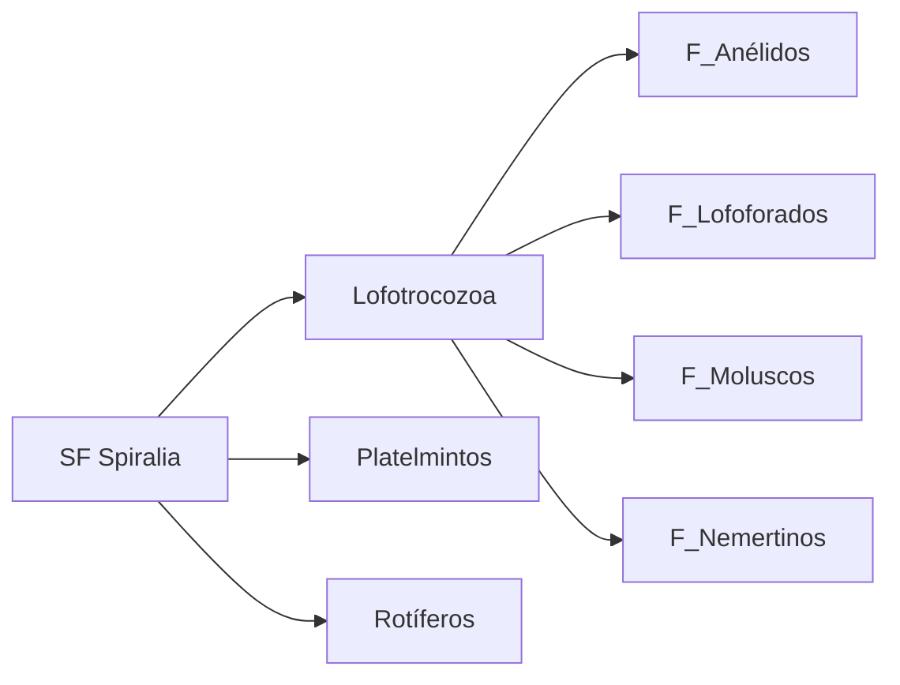
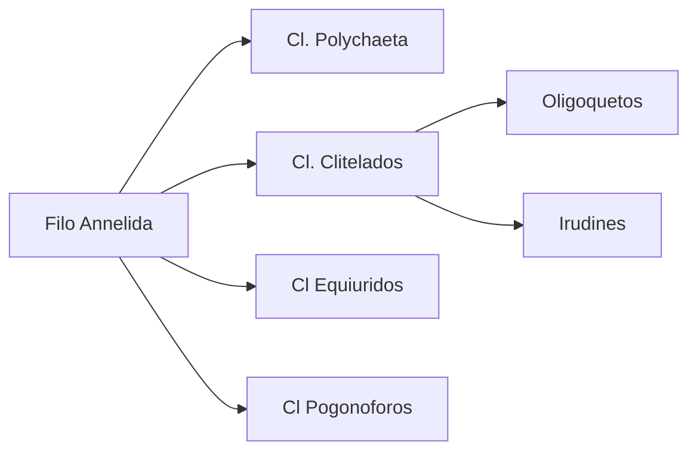

## Lofotrocozoa caracteristicas
Triblásticos, Protostomos, Esquizocelomados
- Larva trocófora: cinturón ciliar, penachos apical y caudal
- Lofóforo 
### Anélidos

| Grupos principales                                                                                                                                                                                                                                                 | Sinapomorfía                                                                                                                                                                                                                                                                                    | Reproduccion                                                                                                                                                                                                                   | Desarrollo Larvas                                                                                                                                                       | Digestivo (SD) / alimentacion (Al)                                                                                                                                                                                                                                                                          | Excretor (SE)                                                                                                                                                                          | Circulatorio (SC)- respiratorio(SR)                                                                                                                                                                                                                          | Esqueleto - Muscular                                                                                                                                                                 | Nervioso_(SN)                                                                                                                                                                                            |
| ------------------------------------------------------------------------------------------------------------------------------------------------------------------------------------------------------------------------------------------------------------------ | ----------------------------------------------------------------------------------------------------------------------------------------------------------------------------------------------------------------------------------------------------------------------------------------------- | ------------------------------------------------------------------------------------------------------------------------------------------------------------------------------------------------------------------------------ | ----------------------------------------------------------------------------------------------------------------------------------------------------------------------- | ----------------------------------------------------------------------------------------------------------------------------------------------------------------------------------------------------------------------------------------------------------------------------------------------------------- | -------------------------------------------------------------------------------------------------------------------------------------------------------------------------------------- | --------------------------------------------------------------------------------------------------------------------------------------------------------------------------------------------------------------------------------------------------------------- | ------------------------------------------------------------------------------------------------------------------------------------------------------------------------------------ | -------------------------------------------------------------------------------------------------------------------------------------------------------------------------------------------------------- |
|     ......... Cl.Poliquetos      ....... Cl.Clitelados    _Oligoquetos_ (lombrices)     _Hirudines_ (sanguijuelas)  ...... Equiuridos (gusanos marinos)  ....... Pogonoforos      | quetas: sedas quitinosas   ....... marinos, quetas en **parápodos**    ....... clitelo  4_quetas/segm   sin quetas   ..... quetas terminales, galerias arena/barro ........ quetas terminales Trofosoma: bact simbioticas  |     ....... **Sex:** dioicos, sin gonadas, epitoquía **Asexual**: (fragmentacion, gemación) ...... Sex: monoicos biparental, gónadas permanentes     ..... Sex dioicos, sin gonadas  | gral: DI: larva trocofora     ...... idem      ..... DD, cocon        ... idem         | TD Completo    ..... predadores, suspensivoros     ......  detritivoros   hematofagos, predadores,  boca con ventosa ....... Al: proboscis  -> predadores    ...... SD: ausente  Al: simbiosis con bacterias (oxidan S reciben O2)  | Metanefridios: -podocitos: ultrafiltración -embudo metanefridial: reabsorción      ........  tiflosol: (intestino repl <sup)        | **SC** tipico: cerrado simple (1 vaso ventral y 1 dorsal) ..........  SR: branquias, parapodios, cutánea.  SC: típico   .....  **SR**: cutánea SC tipico       ....... SC: tip     ...... SC tip | pared muscular longit -> esqueleto hidrostático              Hirudin: cavidad celomatica maciza (simil acelomado) .....     |     ........ -Cordones nerviosos (escalera) - Órganos sensitivos: palpos, antenas, ojos ........... Olig: Cordones fusionados     ..... 1 cordon nervioso   |
### Nemertinos

| Grupos principales           | Sinapomorfía                                        | Reproduccion                                        | Desarrollo Larvas            | Digestivo (SD) / alimentacion (Al) | Excretor (SE)  | Circulatorio (SC)- respiratorio(SR) | Esqueleto - Muscular        | Nervioso_(SN)                               |
| ---------------------------- | --------------------------------------------------- | --------------------------------------------------- | ---------------------------- | ---------------------------------- | -------------- | -------------------------------------- | --------------------------- | ------------------------------------------- |
| marinos, dulceac, terrestres | probóscide: con tubo muscular paralelo al digestivo | Sexual: dioicos, fec externa Asex: fragmentación | DI larva vermiforme parásita | **SD comp** Al predador         | protonefridios | **SC: cerrado** SR: difusion        | SM: circular y longitudinal | SN: anillo esofágico con cordones ventrales |
### Lofoforados

| Taxon            | Grupos principales                                                                                              | Sinapomorfía                                                                                        | Reproduccion                                                                                       | Desarrollo Larvas                               | Digestivo (SD) / alimentacion (Al) | Excretor (SE)                                                                     | Circulatorio (SC)- respiratorio(SR)                                     | Esqueleto - Muscular                                        | Nervioso_(SN) |
| ---------------- | --------------------------------------------------------------------------------------------------------------- | --------------------------------------------------------------------------------------------------- | -------------------------------------------------------------------------------------------------- | ----------------------------------------------- | ---------------------------------- | --------------------------------------------------------------------------------- | -------------------------------------------------------------------------- | ----------------------------------------------------------- | ------------- |
| Lofoforados (sc) |      ..... F Briozoos (ectoprocta)    ...... F Braquiopodos (simil bivalvo) | Lofóforo: tentaculos ciliados p. alimentacion  ..... coloniales    .......  |      .... monoico larva cifonauta-> asexual -> colonia ........ dioicos |      ..... DI larva cifonauta | sist dig en U, suspensivoros    |      ...... SE ausente    ........ Metanefridios |      .... SC ausente    ...... SC abierto | Exoesqueletos: calcio, quitina.  Músculos en lofóforo |               |

### Moluscos

| Taxon       | Grupos principales                                                                                                                                                                                                                             | Sinapomorfía                                                                                                                                                                                                                                              | Reproduccion                                                                                                                                                                                                                                | Desarrollo Larvas                                                                                                                                                                                                                                                 | Digestivo (SD) / alimentacion (Al)                                                                                                                                                                                                                                                                                   | Excretor (SE)                        | Circulatorio (SC)- respiratorio(SR)                                                                                                                                                                                                                        | Esqueleto - Muscular                                                                                                                                                                                                                        | Nervioso_(SN)                                                                                                                 |
| ----------- | ---------------------------------------------------------------------------------------------------------------------------------------------------------------------------------------------------------------------------------------------- | --------------------------------------------------------------------------------------------------------------------------------------------------------------------------------------------------------------------------------------------------------- | ------------------------------------------------------------------------------------------------------------------------------------------------------------------------------------------------------------------------------------------- | ----------------------------------------------------------------------------------------------------------------------------------------------------------------------------------------------------------------------------------------------------------------- | -------------------------------------------------------------------------------------------------------------------------------------------------------------------------------------------------------------------------------------------------------------------------------------------------------------------- | ------------------------------------ | ------------------------------------------------------------------------------------------------------------------------------------------------------------------------------------------------------------------------------------------------------------- | ---------------------------------------------------------------------------------------------------------------------------------------------------------------------------------------------------------------------------------------------- | ----------------------------------------------------------------------------------------------------------------------------- |
| F Molluscos |     --------------Polyplacophora (quitones)     -------------- -Bivalvos   ------------- -Gasteropodos  1.Prosobranquios 2.Opistobranquios 3.Pulmonados ------------- -Cefalopodos | cavidad paleal,  rádula  ------- 8 placas cavidad palial alrededor del pie   ---- 2 placas  sin radula  ------ Torsión de la masa visceral  -> cav palial anterior  ------ cabeza con tentaculos (pie) | - Sexual: dioicos, fec externa  -------------       ----------- Sex: monoicos   --------   1. dioicos 2.monoicos 3.monoicos ------------ Dioicos, semelparos,  fec semi externa | gral  DI: larva  trocofora   -> veliger ---------- solo trocófora     ------- gral    ------ DD terrestres DI marinos y dulceac  ----------- DD huevo telolecitico  Hectocotilo (org transf espermtz) | SD: completo Al:  radula (org raspador)   ------------ Al fitofagos, buena radula     ----- Al filtradores con ctenidio, sin rádula ----------- Gasterópodos: SD: torsión visceral   -------- SD en U Al predadores mandibulas-> pico + radulas bolsa tinta | SE: Metanefridios, osmoconformadores | SR: branquias en cavidad paleal  SC: abierto -----------     ------- SR branquias = ctenidios  ----- SR 1. ctenidio  2. ctenidio 3. pneumostoma     ---- SC cerrado, corazon 3 cameral SR idem | placas calcáreas -> caparazón, generado por el manto  ---------      ----- Apertura:ligamento Cierre: músculos aductores       ----------- endoesqueleto cartilaginoso (cabeza )   | Cordón nervioso                    --- SN muy desarrollado  |
|             |                                                                                                                                                                                                                                                |                                                                                                                                                                                                                                                           |                                                                                                                                                                                                                                             |                                                                                                                                                                                                                                                                   |                                                                                                                                                                                                                                                                                                                      |                                      |                                                                                                                                                                                                                                                               |                                                                                                                                                                                                                                                |                                                                                                                               |