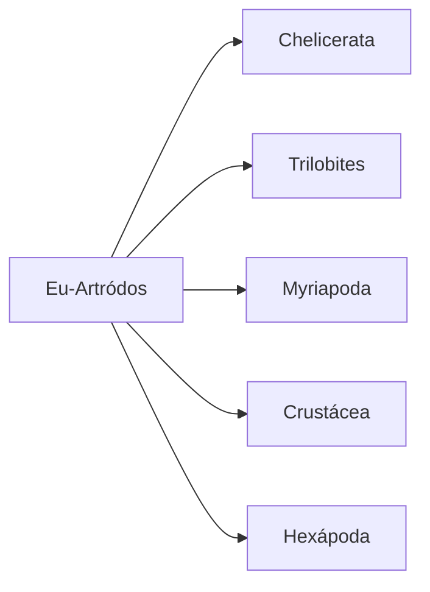
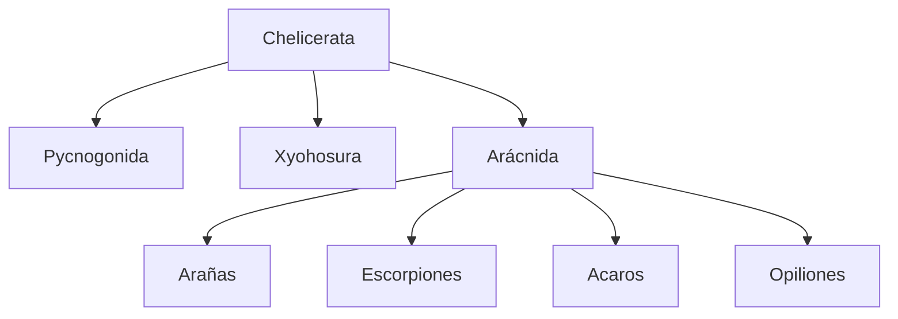
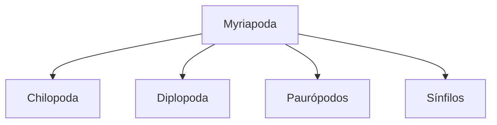
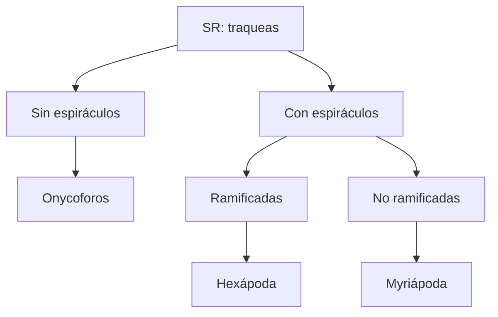

### Sinapomorfías
- Cuticula (muda=ecdisis)
- Hormonas: ecdyzona + HJ
- Cuerpos segmentados con apendices
# Nematoidea
Peudocelomados
cuticula de colágeno
ecdisis

| Grupos principales                                                                                                                                                                                 | Sinapomorfía / Características                                                                                                                                                                                                                                                                               | Reproduccion / Desarrollo                                                                                            | Digestivo (SD) / alimentacion (Al)                                                                                                       | Excretor (SE)                                      | Circulatorio (SC)- respiratorio(SR) | Esqueleto -  Muscular                                           | Nervioso (SN)                           |
| -------------------------------------------------------------------------------------------------------------------------------------------------------------------------------------------------- | --------------------------------------------------------------------------------------------------------------------------------------------------------------------------------------------------------------------------------------------------------------------------------------------------------------- | -------------------------------------------------------------------------------------------------------------------- | ---------------------------------------------------------------------------------------------------------------------------------------- | -------------------------------------------------- | -------------------------------------- | --------------------------------------------------------------------- | --------------------------------------- |
| F Nematodos    1.Ascaris Lumbricoides 'lombriz intestinal'  2.Oxiuro (lombrices blancas)    3.Anquilostomas      4.Filarias (elefantiasis)   | C: segm radial S: faringe tri_radiada  1. huevos grn polen contgio: aguas servidas  2. huevos forma D, zona perianal contgio: contacto, aire  3.dientes cortantes,  contg: directo contacto suelo o alimentos  4. desarrollo en sistma linfatico vector mosquito   | DI, dioicos macho espiculas copuladoras             3. larvas filariformes | Terrestres, acuaticos  SD: completo Al: fitofagos, parasitos           3. Al sangre intestinal | SE: ausente, excreción corporal, sin nefridios  |  SR: difusion SC: abierto        | pseudocele  esqueleto hidrostático  musculatura longitudinal | SN: ntdos: 2 cordones nerv paralelos |
| Nematomorfos                                                                                                                                                                                       | cut colageno                                                                                                                                                                                                                                                                                                    | dioicos, DI                                                                                                       | SD: vestigial, absorción parásita  Al: larvas parasitas artropodos, adultos vida libre                                       | SE ausente                                         |                                        |                                                                       | cordon ventral                          |

# Panartrópoda 
Caracteristicas:
- Esquizocelomados
- hemolinfa baña los órganos dentro del celoma
- corazón muscular pocos vasos sang

| Grupos principales                                                                                                      | Sinapomorfía / Características                                                                                                                                                                                                                      | Reproduccion / Desarrollo                                                                           | Digestivo (SD) / alimentacion (Al)                                                                       | Excretor (SE)                                                                                                 | Circulatorio (SC)- respiratorio(SR)                                                                 | Esqueleto -  Muscular                                               | Nervioso (SN)                                                                                                 |
| ----------------------------------------------------------------------------------------------------------------------- | ------------------------------------------------------------------------------------------------------------------------------------------------------------------------------------------------------------------------------------------------------ | --------------------------------------------------------------------------------------------------- | -------------------------------------------------------------------------------------------------------- | ------------------------------------------------------------------------------------------------------------- | ------------------------------------------------------------------------------------------------------ | ------------------------------------------------------------------------- | ------------------------------------------------------------------------------------------------------------- |
| F Onycophora        ----------- F Tardigrada     ----------- F.EuArtrópoda | cutícula quitina blanda, cubierta con cerdas, sin segmentacion externa   -------- patas no articuladas, cuticula no quitinosa, criptobiosis -------------Segmentación,  exoesqueleto de quitina esclerotizada, apéndices articulados | DI, dioicos, fec interna, ovip y vivip     -------------- dioicos, partenog, ovip | Al: depredadores, usan las glandulas secretoras de mucus  ------- Al: herbívoros y depredadores | SD: completo SE: metanefridios metaméricos    -------- SE: directo osmótico, tubos malpighi | SC: abierto, corazón dorsal SR: traqueal (abierto permanente)    ---------- SC idem  | pared muscular longit -> esqueleto hidrostático   ------ idem | SN cordon ventral en escalera  ----- SN idem       ------ SN: ventral  |
|                                                                                                                         |                                                                                                                                                                                                                                                        |                                                                                                     |                                                                                                          |                                                                                                               |                                                                                                        |                                                                           |                                                                                                               |

# Artrópodos

| ______Taxon_______                                                               | Grupos principales                                                                                                                                                                                                                                                                                                                                                              | Sinapomorfía / Características                                                                                                                                                                                                                                                                                                                                                                                                       | Reproduccion / Desarrollo                                                                                                                                                                                                                                                                                                  | Digestivo (SD) / alimentacion (Al)                                                                                                                                                                                                                                             | Excretor (SE)                                                                                                               | Circulatorio (SC)- respiratorio(SR)                                                                                                                                                                                                                                                   | Esqueleto -  Muscular                                                                       | Nervioso (SN)                                         |
| -------------------------------------------------------------------------------- | ------------------------------------------------------------------------------------------------------------------------------------------------------------------------------------------------------------------------------------------------------------------------------------------------------------------------------------------------------------------------------- | --------------------------------------------------------------------------------------------------------------------------------------------------------------------------------------------------------------------------------------------------------------------------------------------------------------------------------------------------------------------------------------------------------------------------------------- | -------------------------------------------------------------------------------------------------------------------------------------------------------------------------------------------------------------------------------------------------------------------------------------------------------------------------- | ------------------------------------------------------------------------------------------------------------------------------------------------------------------------------------------------------------------------------------------------------------------------------ | --------------------------------------------------------------------------------------------------------------------------- | ---------------------------------------------------------------------------------------------------------------------------------------------------------------------------------------------------------------------------------------------------------------------------------------- | ------------------------------------------------------------------------------------------------- | ----------------------------------------------------- |
| F. artropoda  sF Chelicerata                    | Segm: superficial       -------- Cl Pycnogonida (arañas de mar)    -------- SCl merostomata   Cl xyphosura (cangrejos cacerola)   -------------  Cl Arácnida       -Ord Escorpionida       -Ord Aranea      -Ord ácari     -Ord opilion       -Ord solífugos  | apendices: 2 queliceros, 2 pedipalpos, 8 patas tagmas: cefalotorax + opistosoma --------         ------- No mudan, ojos compuestos y ocelos    ------------- ocelos (ojos simples) .... pedipalpos con pinzas y espiraculos en metasoma ........ gland. de seda en las hileras  ....... tagmas fusionados ..... tagmas continuos (parace fusionado) | DD      -------- dioicos, machos con patas ovigeras (cargan los huevos)   ----------- DI:larva trilobtiforme, dioicos, filopatridos      ------- DD escorp: ovoviviparos, fec. interna (espermatoforo) .... Arañas: oviparas, fec interna  (con pedipalpos) |       --------- Al: succionadores (proboscide), larvas parasitas   ----- predadores: gnatobases y quilarios           ...... Alim: fluidofagia digestion externa ..... (ectoparasitos, hematofagos) |                       ---------- SE: tubos de malpighi |      ------ pycnog SC: ausente      ------- SC: abierto con hemocianina y amebocitos inmunidad SR: branquias en libro (filotraqueas)   ---------- SC abierto, hemocianina en escorp SR traqueas, pulmones en libro(arañas  ) |                                                                                                   | SN: ventral                                        |
| F.Artropoda  sF Trilobites                                                    |                                                                                                                                                                                                                                                                                                                                                                                 | 3 lóbulos (central y laterales), ojos compuestos                                                                                                                                                                                                                                                                                                                                                                                        |                                                                                                                                                                                                                                                                                                                            |                                                                                                                                                                                                                                                                                |                                                                                                                             |                                                                                                                                                                                                                                                                                          |                                                                                                   |                                                       |
| F. Artropoda  sF Myriapoda (mandibulata)                                      |             Cl chilopoda (cinpies)j   Cl diplopoda (milpies)  Cl symphila    Cl pauropodos                                                                                                                                                                                                                 | - tentorio: endoesqueleto encefálico - órganos de Tomosvary (sens antenas) otros: mandibula, tagmas: cabeza y tronco. ..... maxilipedio con uña venenosa ....... 2 par de patas por somito ...... antenas moniliformes  ...... antenas ramificadas                                                                                                                                                     | Repr sexual, DD, oviparos, fec interna o externa         .... (cuidado parental)                                                                                                                                                                                                             |            .... Al : predadores   ..... Al: herbivoros y detritivoros ...... detritivoros                                                                                                                                | SE: tubos de malpighi                                                                                                       | SC abierto, corazon dorsal   SR: traquas con espiraculos no ramificadas      ...... SR: cutanea y traqueas ramificadas los 1ros segmentos ....... SR: ausente  ..... SC: ausente                                                         |                                                                                                   | SN escalera ventral                                   |
| F. Artropoda  sF Crustácea*  * grupo parafiletico que excluye haxapodos |             ....... Cl malacostraca  ....... Cl remipedia (+ primitivos)                                                                                                                                                                                                                                                     | - cuticula con quitina y material calcareo. - 3 tagmas: cabeza, tórax(pereion), abdomn(pleon) - apéndices birrameos (aparición post) ..... apéndices en pleon (abdomen) ....... 2 par de apendices unirrameos x somito, un par antenas birrameo                                                                                                                                                                 | Dioicos, fec ext DI: larva nauplio  cirripedios: herm fec crux, larva nauplio -> cypris (sésil)   ostracodos: parteng                                                                                                                                                                                       | Al:  predadores, carroñeros, suspensivoros: cirripedios  SD:  cang rio: estomago con 2 comp                                                                                                                                                                     | SE: gland antenal y maxilar -> NH3. - marinos: orina isosmotica - dulceacuicola: reabsoorcion de iones x branquias    | SC: abierto corazón dorsal, hemolinfa: sin pigm, hemocianina, hemoglobina.  SR: branquias, (apendices abdominales resp ),(cuticular)                                                                                                                                         | Exoesqueleto de quitina y material calcáreo.  Músculos  estriados antagónicos (mov rápidos) | SN: cerebro (+ ganglios cabeza) + cordon ventral nerv |
| F. Artropoda  sF Hexapoda                                                     |     Cl enthognata (protura, diplura, colembola)     Cl ectognata (insecta)   Hemimetab: hemiptero, ortoptero, blattodea, odonata   Holometab: coloeptera, diptera, lepidoptera, hymenoptera                                                                                                                                        | - 6 patas unirrameas -3 tagmas: cta ...... piezas bucales dentro de capsula cefalica ...... piezas bucales externas                                                                                                                                                                                                                                                                                                      | Dioicos, (partenog), fec interna ...... DI Ametábolos  ...... DI: ametabolos, hemimetabolos, holometabolos.                                                                                                                                                                                        | SD: completo, molleja trituracion  Al: fitofagos, parásitos, depredadores                                                                                                                                                                                                | SE: tubos de malpighi, excreción concentrada ácido úrico                                                                    | SR: traqueal ramificado, con espiráculos                                                                                                                                                                                                                                                 | Exoesqueleto de quitina  SM: músculos estriados antagonicos, músculos lisos                 | SN:  cordon nervioso, con celulas neurosecretoras     |
|                                                                                  |                                                                                                                                                                                                                                                                                                                                                                                 |                                                                                                                                                                                                                                                                                                                                                                                                                                         |                                                                                                                                                                                                                                                                                                                            |                                                                                                                                                                                                                                                                                |                                                                                                                             |                                                                                                                                                                                                                                                                                          |                                                                                                   |                                                       |

## Comparación apéndices

| Grupo      | Cabeza                                                                   | Torax                                                                                      |
| ---------- | ------------------------------------------------------------------------ | ------------------------------------------------------------------------------------------ |
| Myriapodos | 1 par: antenas maxilas mandibula                                   | Tronco Chilopoda: 1 par patas/segm + maxilipedio Diplopoda: 2 par patas x somito  |
| Crustaceos | 2 pares: antenas maxilas mandibula                                 |                                                                                            |
| Hexapodos  | 1 par: antenas, mandíbulas 2 pares: maxilas ( 1 par + labro soldadas) | 3 pares patas 1 o 2 par alas (apteros)                                                  |
|            |                                                                          |                                                                                            |

