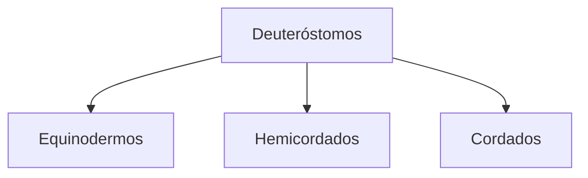
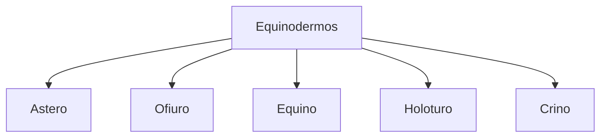
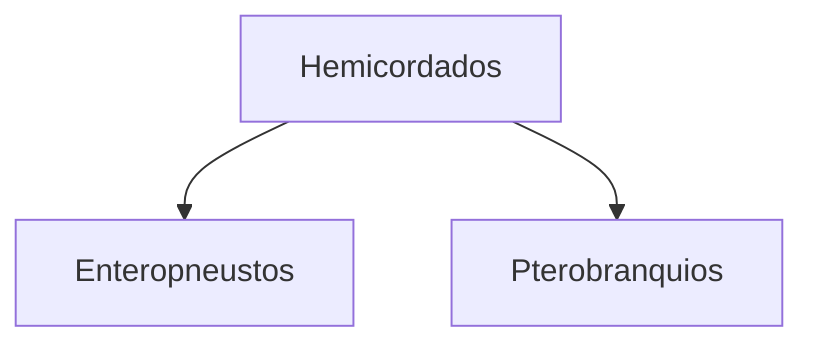
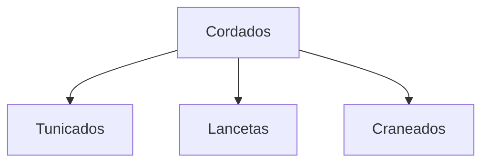

n## Sinapomorfías
- Enterocelomados
- Blastoporo no forma la boca
- Segmentación radial
- Embrión regulador (blastómeros separados viables)
- hendiduras branquiales faríngeas

_____

| ______Taxon_______                                             | Grupos principales                                                                                                                                                                                                                                                                           | Caract / Sinapomorfía                                                                                                                                                                                                                                                                                                               | Reproduccion / Desarrollo                                                                                                                                                                                                | Digestivo (SD) / alimentacion (Al)                                                                                                                                                                                                                                                                                                                              | Excretor (SE)                                                                                                                           | Circulatorio (SC)- respiratorio (SR)                                                                                                                                                                                                                                                                                                                   | Esqueleto (SE) -  Muscular (SM)                                                                                                                                                    | Nervioso (SN)                                                                              |
| -------------------------------------------------------------- | -------------------------------------------------------------------------------------------------------------------------------------------------------------------------------------------------------------------------------------------------------------------------------------------- | -------------------------------------------------------------------------------------------------------------------------------------------------------------------------------------------------------------------------------------------------------------------------------------------------------------------------------------- | ------------------------------------------------------------------------------------------------------------------------------------------------------------------------------------------------------------------------ | --------------------------------------------------------------------------------------------------------------------------------------------------------------------------------------------------------------------------------------------------------------------------------------------------------------------------------------------------------------- | --------------------------------------------------------------------------------------------------------------------------------------- | --------------------------------------------------------------------------------------------------------------------------------------------------------------------------------------------------------------------------------------------------------------------------------------------------------------------------------------------------------- | ---------------------------------------------------------------------------------------------------------------------------------------------------------------------------------------- | ------------------------------------------------------------------------------------------ |
| F_Equinodermos                                                 |               ....... 1. asteroideos (estrellas planas)  .............. 2. Ofiuroideos (estrellitas) .............. 3. Equinoideos (erizos) .............. 4. Holoturoideos (pepinos) ....... 5. Crinoideos (lirios) | C: bentonicos, pérdida de hendiduras branquiales S: endoesqueleto epinoso de placas, sistema vascular acuoso (**SVA**).    1. con surco ambulacral  2. Sin surco ambulacral                                                                                                                                       | DI: larvas ciliadas  bilateral planctónica.  Dioicos, fec. externa, ovíparos (asexual).      1. larvas: bipinaria  -> braquiolaria  2. bursa recibe los espermat  .......   | Tubo dig simple  Pepinos, erizos: ramoneadores (algas)  Ofiuros: suspensivoros  Estrellas: depredadoras   ....... 1 SD: completo/ incompleto(sin ano) ..... 2 SD incompleto detritivoros ...... ramoneadores (algas) ............ ramoneadores (algas) = detritivoros ....... Suspensivoros SD en U | Por difusión asociada a los órganos respiratorios. osmoconformadores 4. arb respiratorios                                               | SR: branquias dérmicas (pápulas), pies ambulacrales  SC:  - SVA ->  intercambio gasesoso. - sistema hemal: transp nutrientes y desechos.  2. Sin pápulas ni pedicelarios, SR: bursa (bolsas en boca)  3. SVA 4. árboles respiratorios          ...... Holo: SR arboles cloacales     | Endoesqueleto mesodermico de CaCO3  Mov hidraulico: sist vascular acuifero-> pies ambulacrales   3. forman valvas (se cierra)  4. placas microscopicas (cuerpo blando) | anillo circunmoral (boca y ano) y nervios radiales en brazos                               |
| F_Hemicordados                                                 |            Cl. Enteropneusto    Cl. Pterobranquis                                                                                                                                                                                               | con cordados: hendiduras branquiales, cordón nervioso dorsal hueco  exclusivos:  estomocorda, glomérulo, probóscide. ...... marinos, excavadores   ....... sésiles, coloniales                                                                                                                        | DI: larva coronaria        ....... Dioicos, fec externa  ..... dioicos, monoicos, asexual x  gemación                                                                                |          .......... excavadores, sedimentívoros: probóscide con mucus ....... sedentarios, filtradores: tentáculos con mucus                                                                                                                                                                                             | SE: Glomérulo único sin nefridios                                                                                                       | SC: abierto, corazón dorsal, vasos dorsales y ventrales  SR: hendiduras branquiales                                                                                                                                                                                                                                                                 |                                                                                                                                                                                          | Plexo nervioso (similar a equinodermos) cordones dorsal y ventral con anillo en el collar. |
| F_Cordados                                               |                                                                                                                                                                                                                                                                                              | notocorda  cordón nervioso dorsal hueco  divertículos  faringeo s(hendiduras en acuaticos)  Endostilo o gl tiroides derivadas  cola postanal                                                                                                                                                                   |                                                                                                                                                                                                                          | SD: completo                                                                                                                                                                                                                                                                                                                                                    |                                                                                                                                         | SC: cerrado, corazon ventral, may sangre con hemoglobina                                                                                                                                                                                                                                                                                                  | SE: endoesqueleto de crec. continuo.  SM: segmentado en miotomos (somitos)                                                                                                   | médula espinal dorsal + cerebro                                                            |
| F_Cordados sF_Urocordados (tunicados) Enterocelicos   |      ............ Cl ascidacea (papas de mar)   ......................... Cl thaliacea (barrilitos)  .............. Cl larvacea                                                                                                                       | Revestido por túnica de proteínas y polisacáridos  .............. cavidad atrial    ......... SM   ....... adulto pedomorfico dentro de habitáculo mucoso                                                                                                                                       |      ............... DI larva renacuajo   ...... DI (metagénicos sex+asex) .............. DD: pedomorfosis                                                                     |      .............. Al: filtradores sesiles bentonicos ..... Al filtradores planctonicos   .... filtrador                                                                                                                                                                                                                   |                                                                                                                                         | SR: difusión, la faringe gran sup intercambio gases ............. SC: abierto, corazon con pulsaciones que cambian de sentido.                                                                                                                                                                                                                   |      ...............     ................... SM: Bandas de musculatura circular                                                                         |      ................ SN: ganglio nervioso unico                         |
| F_Cordados  sF_Cefalocordados (lancetas)              |                                                                                                                                                                                                                                                                                              | cavidad peribranquial, caract típicas de cordados (anfioxo)                                                                                                                                                                                                                                                                            | DI                                                                                                                                                                                                                       | SD: tubo digestivo recto  Al: filtrador                                                                                                                                                                                                                                                                                                                   | SE: nefridios pequeños                                                                                                                  | SC: CERRADO, sangre sin pigmentos  SR: respiración superficial/ branquial                                                                                                                                                                                                                                                                           | SM: somitos musculares en V                                                                                                                                                              | SN: tubo nervioso encima de la notocorda sin cerebro                                       |
| F_Cordados  sF_Craneados (vertebrados)                   |                                                                                                                                                                                                                                                                                              | - Endoesqueleto vivo - Cráneo - Extremidades pares - Faringe y SR eficaz - Sist endocrino                                                                                                                                                                                                                                  |                                                                                                                                                                                                                          |                                                                                                                                                                                                                                                                                                                                                                 | SE: riñones con nefronas                                                                                                                | SR: branquial                                                                                                                                                                                                                                                                                                                                             | SM:  miómeros en W  epidermis: epitelio estrat, dermis: tej conj (meso)  SE: cartílago o hueso columna encefalo                                                  | SN: 10-12 nervios craneales, nervios espinales                                             |
| sF_Craneados    iF_Agnatha                               | Cl mixines      ............... Cl lamprea                                                                                                                                                                                                                              | sin mandíbulas,  sin vertebras, sin apéndices pares cráneo incompleto ............... cráneo completo vertebras cartilaginosas                                                                                                                                                                                          | DD monoicos (un solo sexo funcional), Fec externa  .... DI larva amnocete, etapa larvaria prolongada                                                                                                         | Al: carroñeros                                                                                                                                                                                                                                                                                                                                                  | SE: adulto riñón pronéfrico. Excreción isoosmótica  ............. SE:  embrion ->  mesonefro adulto ->  opistonéfrico |                                                                                                                                                                                                                                                                                                                                                           |                                                                                                                                                                                          | SN: cordon nervioso dorsal. Cerebro sin cerebelo                                           |
| sF_Craneados   iF_Gnathostomata (con mandibulas)         | Cl condrictios         ----------- SCl osteictios      Cl Actinopterigio     Cl Sarcopterigio                                                                                                                  | Esq cartílago, Boca ventral, Escamas placoides o sin, Cola heterocerca, Ampollas lorenzini  ----------- Esq endocondral, vejigas natatorias, dientes con esmalte ............. Escamas dérmicas,   ..... aletas articuladas lobuladas, pulmonados, aleta caudal dificerca,  respiración O2 atmosf. |                                                                                                                                                                                                                          |                                                                                                                                                                                                                                                                                                                                                                 | SE: riñon opistonefrico  Isosmoticos: alta conc  urea y TMAO    ----------- SE: riñon opistonefrico          | SC:  cerrado, corazón bicameral  SR: branquias sin opérculos  ----------- SR: branquias con opérculos, pulmones  SC: cerrado, corazón bicameral recibe sangre desoxigenada ........ SC: doble pulmonar y sistémico, corazon con 3 camaras                                                                   | SE: cartílaginoso        ---------- SE: endocondral calcificado                                                                                               |                                                                                            |
|                                                                |                                                                                                                                                                                                                                                                                              |                                                                                                                                                                                                                                                                                                                                        |                                                                                                                                                                                                                          |                                                                                                                                                                                                                                                                                                                                                                 |                                                                                                                                         |                                                                                                                                                                                                                                                                                                                                                           |                                                                                                                                                                                          |                                                                                            |

## referencias
 SF: superfilo
sF: subfilum
iF: Infrafilo
sc: sin categoria
