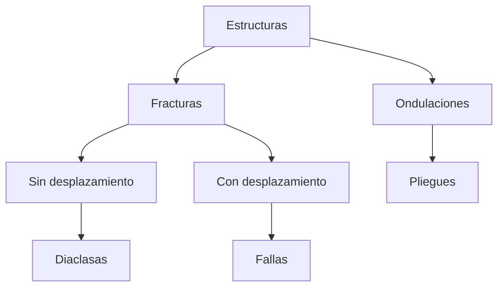

## Clasificacion

Clasificaion geometrica (formas)
- Concordancia: estratos de formas similares
- Discordancia: estratos disimiles

Clasificacion genetica (formacion)
- Continuidad: sin interrupcion en la sedimentacion
- Disconinuidad: se interrumpe la sedimentaion y se pierden estratos

Laguna: periodos en los que falta un deposito por hiato o erosion
	Hiato: periodo de tiempo en el que no hay deposicion 
	Vacio erosional: capa eliminada por erosion

![[https://i0.wp.com/geotecniafacil.com/wp-content/uploads/2018/12/Tipos-fallas-geolgicas.jpg]]

![[https://escueladelmarquesado.wordpress.com/wp-content/uploads/2020/09/4e068-discontinuidades2bestratigraficas.jpg]]
