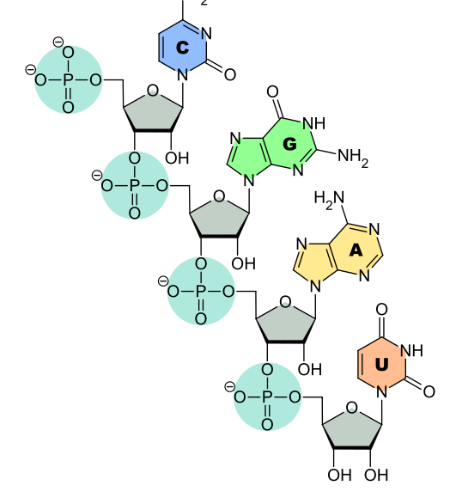
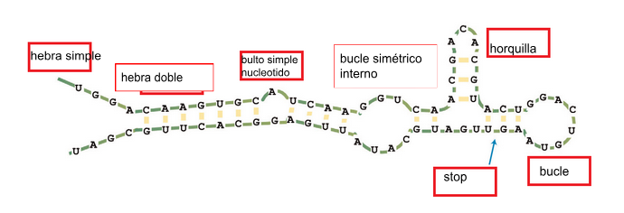
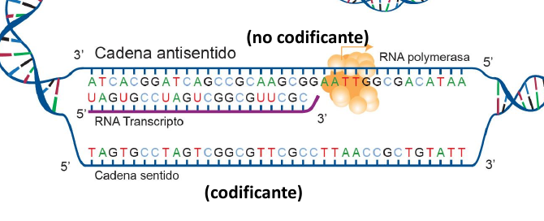

# Estructura

a) Se trata de la estructura primaria de una secuencia de desoxirribonucleótidos.
F, son ribonucleotidos, el azúcar es una ribosa porque tiene el grupo OH- en el carbono 2’ (en vez de solo H como la desoxiribosa del ADN) y esta presenta la base uracilo.

b) Es un ácido nucleico formado por dos cadenas antiparalelas. 
F, es una sola cadena, auunque en determinadas situaciones pueden tener como estructura secundaria una cadena doble

c) La polaridad  5’ -> 3’de este oligonucleótido está determinada por la ubicación de los átomos de oxígeno. 
F, estadeterminada por la union de los fosfatos en los carbonos 5' y 3' que estan determinados por el grupo principal de la molecula (=O carbonilo)

d) La base nitrogenada está unida al carbono 1’ de la ribosa. V

e) Las bases nitrogenadas que se pueden encontrar en este ácido nucleico son: Adenina, Guanina, Timina, Citosina y Uracilo. 
F, no hay timina.

# Propiedades
2. Con respecto a las propiedades físico-químicas del RNA, diga si las siguientes afirmaciones son Verdaderas o Falsas. Justifique las respuestas Falsas.

a) El RNA es hidrofóbico debido a que no puede formar puentes de hidrógeno. 
F, forma puentes hidrogeno por lo tanto es hidrofilico como el ADN, solo las bases nitrogenadas son hidrofobicas, no se forman los puentes hidrogenos por la inestabilidad de la ribosa

b) El RNA es más soluble que las bases que los forman. 
V, polaridad negativa otorgada por los grupos fosfato

c) El RNA es de naturaleza alcalina, ya que los grupos fosfato presentan dos cargas negativas.
F, la carga negativa hace que sean de naturaleza acida. 

d) Químicamente el RNA es más estable que el DNA debido a que carece del grupo (-OH) en el carbono 2’ de la ribosa. 
F, el RNA es mas reactivo por la presencia del -OH en el C2’ susceptible de hidrólisis alcalina

 e) El RNA puede presentar actividad catalítica.
 V. Las ribozimas pueden catalizar varias reacciones químicas, como la actividad peptidil-transferasa del RNAr
  

# Tipos de ARN

| RNA                                                    | TAMAÑO                                 | FUNCIÓN                                                                                          |
| ------------------------------------------------------ | -------------------------------------- | ------------------------------------------------------------------------------------------------ |
| RNAm Mensajero                                         | depende del tamaño del gen transcripto | Traduccion de proteinas                                                                          |
| RNAr ribosomal                                         | 1,5 a 3 kb                             | Une el codon del ARNm con el anticodon del ARNt y cataliza la union peptidica de los aminoácidos |
| RNAt transferencia                                     | 80 bases                               | Transporte de aa, reconocimiento del codon,                                                      |
| RNAhn heterogéneo nuclear                              | muy largo (varias kb)                  | es el pre-ARNm, producto inmediato de la transcripción génica en eucariotas                      |
| snRNA nuclear pequeño                                  | 200-300 bases                          | participan del splicing  del RNAhn como parte de ribonucleoproteinas                             |
| miRNA Micro RNA, siRNA RNA de interferencia pequeño | 22-25 bases                            | regulación génica uniendose al RNAm                                                              |
| RNAs no codificadores largos (lncRNA)                  | 200 bases                              | splicing, traducción, regulación transcripcional                                                 |

# Estructuras secundarias

5. Describe las propiedades compartidas entre una enzima (proteica) y una ribozima (ARN).
Catalizan reacciones químicas con alta especificidad gracias a sus estructuras secundarias y terciarias complejas. Pueden haber sido el origen de la vida (teoria mundo de ARN). Ribozimas en gral asociadas a expresion genica

6. En el esquema se muestra el RNAt de alanina de una levadura: a) identifica y nombra las bases inusuales; b) identifica cualquier apareamiento no canónico de las bases.
  
  

a- Ribotimidina (T), Dihidrouridina (DHU), Inosina (I)
b- G-U, U-U

7. Crea una tabla que resuma las diferencias entre DNA y RNA (ayuda: traduce la tabla que vimos en el teórico)

| RNA                                                     | DNA                                                                   |
| ------------------------------------------------------- | --------------------------------------------------------------------- |
| Simple cadena                                           | Doble cadena                                                          |
| Azucar ribosa                                           | Azucar desoxiribosa                                                   |
| base uracilo                                            | base timina                                                           |
| cuando es simple hebra no siglue las reglas de chargaff | siempre sigue la regla de chargaff siempre que este como doble cadena |
| poco estable (-OH en C2')                               | muy estable                                                           |
| hidrolisis alcalina                                     | hidrolisis acida                                                      |
| no hay distintas formas fisiologicas                    | variantes fisiologicas: B, A y Z                                      |
8. El siguiente esquema representa el proceso de transcripción en el cual una cadena de DNA se transcribe a RNA: 
1. Completa el nombre de cada hebra de DNA durante la transcripción. 
2. Indica cuál es la hebra codificante. Explica brevemente
la cadena antisentido o no codigicante es la que hace de plantilla, la cadena codificante tendra la misma informacion que el ARN transcripto
 

9. a) Copia la secuencia nucleotídica del transcripto del RNA de la imagen anterior. Recuerda que por convención las cadenas nucleotídicas SIEMPRE se escriben de 5´ -> 3’. No olvides de INDICAR la polaridad de la secuencia
b). Usando el código génetico traduce esta secuencia a la secuencia aminoacídica correspondiente (ayuda: comienza a partir del segundo triplete, porque el primer triplete  corresponde a un codón STOP)
c) PARA PENSAR: Imagina que estás trabajando en un laboratorio de Biología Molecular. La secuencia en estudio corresponde  a una nueva proteína que no había sido secuenciada y tu director te dice que envíes la secuencia a la base de datos NCBI.  Qué secuencia enviarías? Escríbela tal cual la enviarías

  
  
