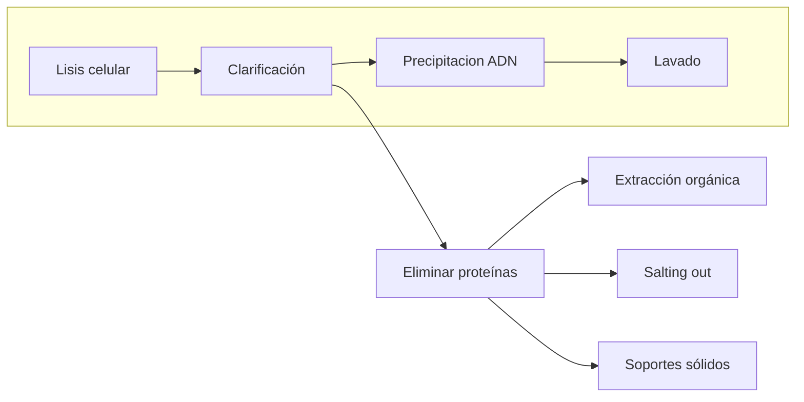

1. ¿Cuáles son los objetivos de una buena extracción de ácidos nucleicos (AN)? Explica
Extraer la mayor cantidad posible, con la mejor calidad (integros, sin desnaturalizacion ni degradacion) y pureza (sin otros AN, proteínas, etc).

2. ¿Qué diferencia existe entre los términos “extraer” y “purificar” AN?
Con extraer hacemos referencia a sacar los componentes de la célula, y con purificar a eliminar las moléculas que no sean AN.

3. Esquematiza las etapas generales de una extracción de AN.
Disgregación del tejido → Lisis celular → Clarificación → Purificación

4. ¿Qué métodos conoces para disgregar tejidos y lisas las células?
Se pueden usar métodos fisicos (tejidos: mortero con N2, células: presión y sonicación) y métodos químicos (detergentes, enzimas, NaOH)

5. ¿Cuáles son los componentes que debe contener una solución de lisis? Explica su función
Detergentes para romper la pared y membranas, quelante para evitar que actúen las nucleasas. 

6. ¿Qué es un quelante? (Investiga su definición química)
Es un agente que secuestra iones metalicos, forma un complejo estable dejandolo sin disponibilidad de reaccion. 
Ej. el magnesio cofactor necesario para enzimas.

7. ¿Qué es un agente caotrópico? ¿Cuáles se usan en la extracción de AN?
Es una sustancia química que tiene la capacidad de desestabilizar la estructura de las biomoléculas, como proteínas y ácidos nucleicos, al interrumpir las interacciones no covalentes que mantienen su estructura tridimensional. Se usan Cloruro de sodio (NaCl), y cloruro de cesio.

8. ¿Qué función tiene el fenol o las mezclas de fenol/cloroformo o fenol/cloroformo/alcohol isoamílico en la purificación de AN?
Fenol: fase organica apolar
Cloroformo: desnaturalizacion
Alcohol Isoamilico: reduce la formacion de espuma mejorando la eficiencia

9. ¿En la purificación de AN, ¿cuándo usarías fenol ácido? ¿Cuándo usarías fenol básico?
Para extracción de ADN fenol básico y para ARN fenol ácido, en medio alcalino el los OH- de la solucion reaccionan capturando el H del OH- del ARN

10. ¿Qué sales se usan para precipitar proteínas durante la purificación de AN?
Se usa cloruro de sodio, acetato de potasio y acetato de amonio

11. Si quieres purificar ARNm utilizando un método rápido ¿qué método usarías? Explica su fundamento.
Matriz con oligo dT porque retendra las colas de poli adenina

12. ¿Qué propiedades de solubilidad se aprovecha para purificar AN?
La precipitacion con componentes organicos

13. Etanol e isopropanol se usan para precipitar los AN. Explica las características de uso de cada uno.
- Etanol: con poco volumen de muestra, moleculas grandes, almacenamiento prolongado
- Isopropanol: disponibilidad de volumen, poca concentracion, reaccion rapida

15. ¿Qué solución se usa para lavar un precipitado de AN o los AN unidos a una columna?  Explica cómo funciona su efecto de lavado.

16. Enumera las precauciones a tener en cuenta en la resuspensión y almacenamiento del ADN.

17. Enumera las precauciones a tener en cuenta en la resuspensión y almacenamiento del ARN.