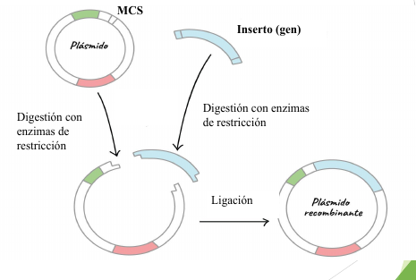
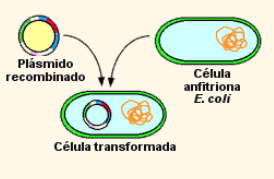

# TPL 4: transformacion bacteriana
## Introducción
Los plásmidos son moléculas de ADN extra cromosómicas, circulares y de pequeño tamaño, pueden contener genes que contribuyen a la supervivencia en condiciones adversas, como los que confieren resistencia a antibióticos. Tienen replicación relajada: de forma independiente al DNA cromosómico y con varias copias por célula
> Plásmido + inserto = ADN recombinante

La incorporación del plásmido en una bacteria competente produce la transformación bacteriana
## Objetivo
Transformar bacterias competentes por "shock térmico" usando plásmido recombinante y seleccionar las transformadas.

## Métodos y materiales
- Trabajando cerca del mechero, agregar 2 μl de plásmido (o el equivalente a 0,5 μl) a un tubo eppendorf que contenga 50 μl de bacterias competentes.
- Preparar control: eppendorf con 50 μl de bacterias competentes.
- Mezclar suavemente y dejar ambos eppendorf en hielo durante 30 minutos.
- Colocar los tubos eppendorfs en un baño termostatizado a 42 °C durante 90" sin agitación (respetar estrictamente el tiempo) -> se generan microporos en la membrana plasmática.
- Colocar inmediatamente los eppendorf en hielo durante 2 minutos, de este modo
completaremos el shock térmico, y con la T° baja no actúan las nucleasas.
 - Agregar 400 μl de medio LB líquido sin antibiótico y llevar a la estufa de incubación a 37 °C durante 15 minutos.

